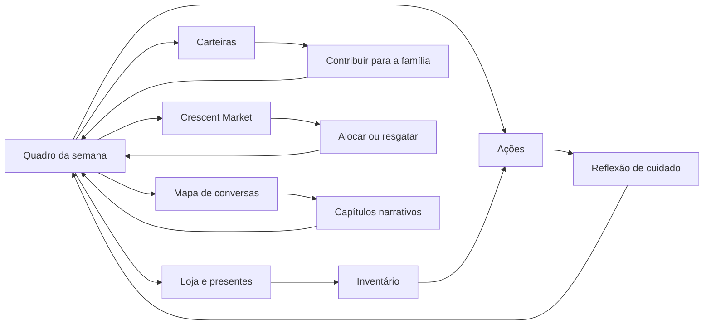

# Interface de Rotina — The Croe Trio

## Estrutura de navegação

O botão inicial passa a abrir a **Semana 1**. A partir do quadro de rotina, a pessoa jogadora pode visitar ações, loja, carteiras, investimento ou mapa de conversas sem perder o estado do dia.

## Quadro da semana

O quadro mostra dia, bloco de tempo, energia, saldo pessoal, fundo da família e alocação fictícia. A composição usa a janela do penthouse como pano de fundo; os cartões são “portas” de apartamento, não widgets financeiros isolados. Uma nota de oportunidade em baixo recorda que uma ação de cuidado pode ser gratuita e, ainda assim, importante.

| Porta | Pergunta de interface | Ação principal |
|---|---|---|
| **Tempo** | “O que cabe nesta parte do dia?” | Escolher trabalho, cuidado ou date. |
| **Casa** | “Que recurso é partilhado?” | Contribuir ou financiar um cuidado coletivo. |
| **Bolsa** | “O que podes comprar sem transformar isto em dívida?” | Comprar, guardar ou oferecer um item. |
| **Mercado** | “Quanto risco cabe na semana?” | Aplicar ou resgatar capital fictício. |
| **Conversas** | “Quem precisa de presença, não de solução?” | Abrir o mapa relacional. |

## Feedback de ação

Após qualquer ação, um painel curto mostra quatro elementos: o que mudou, uma memória criada, o custo em tempo/energia/dinheiro e a rota afetada. Um cuidado não pode exibir “+amor”; ele mostra, por exemplo, **“Segurança +1”** ou **“Tensão −1”**, sempre associado a uma resposta narrativa.

## Hierarquia financeira

A carteira pessoal recebe o destaque plum-magenta, porque a pessoa jogadora controla a decisão. O fundo da família é dourado e mostra a contribuição coletiva. O investimento usa azul-prata e é explicitamente marcado como **simulado**. Nenhum destes painéis aparece sobre uma personagem como se fosse uma medida do valor dela.
