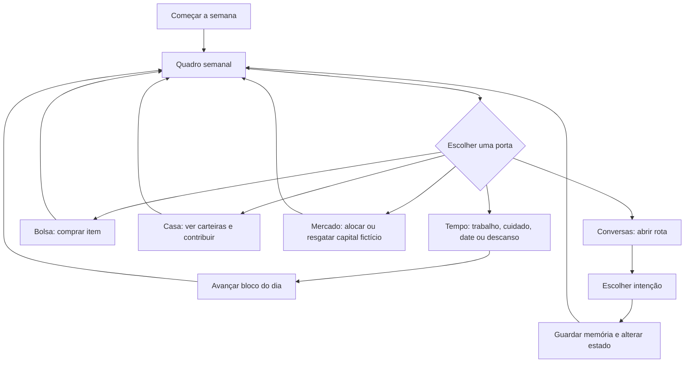
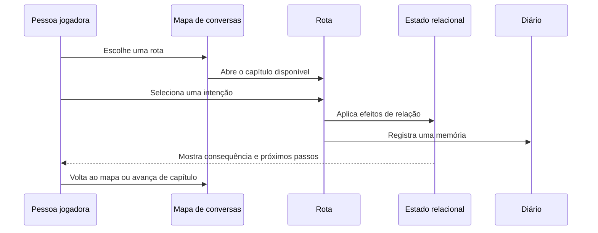

# Game Design Document — *The Croe Trio*

| Campo | Definição |
|---|---|
| **Versão do documento** | 1.0 |
| **Estado do produto** | Protótipo jogável em expansão |
| **Género** | Date sim narrativo com rotina, gestão leve e drama relacional contemporâneo |
| **Plataforma** | Navegador, com interface responsiva para desktop e telemóvel |
| **Experiência central** | Escolher como estar presente: conversar, trabalhar, cuidar, oferecer, esperar e construir próximos passos sem tratar pessoas como recompensas. |
| **Princípio de segurança** | Intimidade, dates e presentes dependem de contexto, limites e segurança; não existe uma mecânica de “comprar afeto”. |

> **Premissa:** depois de uma mudança silenciosa nas relações de um apartamento partilhado, a pessoa jogadora tem uma semana para administrar tempo, dinheiro, energia e conversas. O objetivo não é “vencer” uma personagem, mas descobrir que forma de presença, reparação, aproximação ou pausa é possível para cada vínculo.

## 1. Visão do jogo

*The Croe Trio* é um romance interativo de ensemble. A experiência acontece numa cidade em tons de madrugada e começa no penthouse do Croe Trio, onde a intimidade já existe, mas os seus acordos deixaram de ser claros. O jogo combina o ritmo de um date sim — encontros, presentes, favores e rotinas — com um modelo relacional que considera **vínculo**, **clareza**, **segurança** e **tensão** em vez de um único medidor de afinidade.

O projeto é estruturado para que cada escolha tenha uma consequência observável, mas não uma resposta universal. Uma resposta direta pode aumentar a clareza e também elevar a tensão. Um pedido de pausa pode proteger a segurança, ainda que atrase uma aproximação. Um presente só se torna significativo quando se relaciona com uma conversa ou uma necessidade expressa. O jogo trata a economia como capacidade de planeamento, e não como um atalho para romance.

### 1.1 Objetivos de experiência

| Objetivo | Como o design responde |
|---|---|
| **Criar intimidade sem posse** | As escolhas usam intenções — escutar, perguntar, ser honesto e dar espaço — e nunca “opções corretas” universais. |
| **Fazer tempo e dinheiro importarem** | Três blocos diários, energia, trabalho, compras e duas carteiras criam escolhas de oportunidade. |
| **Manter cada personagem como pessoa completa** | Toda rota tem necessidades, limites e memórias próprias; as personagens não são itens colecionáveis. |
| **Permitir rumos saudáveis que não terminam em casal** | Epílogos incluem aproximação, ritmo partilhado, continuação aberta e pausa protetora. |
| **Conservar o tom maduro** | A interface descreve presença, cuidado, clareza e consentimento em vez de conquista, ranking ou pontuação romântica. |

## 2. Pilares de design

### Relações antes de rótulos

O jogo não força a pessoa jogadora a definir uma relação antes que as personagens tenham condições para isso. O foco está no que cada pessoa precisa naquele momento: atenção, reparação, coragem, contexto, espaço ou consistência.

### Consentimento e autonomia primeiro

Dates exigem segurança mínima. Ações de cuidado podem ser recusadas ou simplesmente não alterar um estado se não houver contexto. Um limite, uma pausa ou uma escolha de ir embora são resultados válidos e nunca são tratados como falha moral.

### Economia sem mercantilizar afeto

Dinheiro dá acesso a ingredientes, presentes e experiências, mas não compra pontos diretos. Um item apenas **habilita** uma ação; a ação só afeta a rota quando o gesto, o tempo e o limite são apropriados.

### A casa como sistema emocional

O penthouse não é apenas cenário. Ele é o nó que conecta o Croe Trio, Alice & Adam e as decisões de rotina. A carteira da família representa recurso coletivo; tarefas domésticas podem diminuir tensão; a escolha de contribuir não compra qualquer resultado individual.

### Falha saudável

Ficar sem dinheiro, energia ou segurança não encerra uma rota. O jogo oferece alternativas de baixo custo — descansar, caminhar, preparar chá, arrumar, escrever uma mensagem honesta ou pedir espaço. A restrição muda o plano, não diminui o valor de ninguém.

## 3. Mundo, tom e elenco

O tom é o de uma manhã depois de uma decisão: urbano, íntimo, um pouco desconfortável e aberto à reparação. A cidade aparece através das janelas; o apartamento guarda pausas, conversas e pequenas rotinas; o café, o clube, a estação e o bairro expandem o mundo sem retirar o penthouse do centro emocional.

| Rota | Arco central | Capítulo 1 — Notar | Capítulo 2 — Responder | Capítulo 3 — Escolher |
|---|---|---|---|---|
| **Pamela & Jessica** | Pertença dentro do núcleo | *O sofá às 07:12* | *O que pertence a todos* | *A manhã seguinte* |
| **Alice & Adam** | Responsabilidade e reparação | *A porta entreaberta* | *Responsabilidade concreta* | *O que vem depois* |
| **Elise** | Cuidado sem transformar alívio em fuga | *O café depois da chuva* | *O ritmo da mesa junto à janela* | *Uma cadeira para dois* |
| **Raven** | Intensidade escolhida, não imposta | *Música atrás da porta* | *Luzes acesas* | *Depois da última música* |
| **Saskia** | Estabilidade gradual e reversível | *Debaixo do mesmo guarda-chuva* | *Coisas pequenas* | *Uma chave que não é promessa* |

O Croe Trio é a âncora inicial. Pamela e Jessica apresentam a questão de pertença sem posse; Alice e Adam confrontam ausência e responsabilidade; Elise oferece um espaço de cuidado sem salvação; Raven explora intensidade e autonomia; Saskia transforma a estabilidade em prática quotidiana, não em promessa apressada.

## 4. Loop principal

O jogo alterna entre a gestão de uma semana e conversas por rota. A pessoa jogadora pode visitar o mapa de conversas em qualquer ordem, mas os capítulos de uma mesma rota permanecem sequenciais.

### 4.1 Ciclo de conversa

Cada rota possui três capítulos. A conclusão de uma conversa registra uma memória, altera os atributos da rota e apresenta uma reflexão. A pessoa jogadora pode voltar ao mapa ou avançar para o próximo capítulo disponível.

## 5. Mecânica relacional

### 5.1 Atributos

Cada rota mantém um estado independente. O que acontece com Elise não corrige automaticamente o vínculo com Pamela & Jessica, nem uma pausa com Alice & Adam reduz a importância de Raven ou Saskia. Essa separação impede que uma personagem se transforme num recurso para resolver outra relação.

| Atributo | Pergunta de design | Como tende a crescer | Como tende a deteriorar |
|---|---|---|---|
| **Vínculo** | Existe calor e disponibilidade para continuar presente? | Reconhecimento, atenção consistente e compromissos pequenos cumpridos. | Promessas vazias, uso instrumental de alguém e evasão. |
| **Clareza** | As pessoas conseguem nomear necessidades e expectativas? | Perguntas abertas e honestidade concreta. | Pressuposições, respostas vagas e conversa evitada. |
| **Segurança** | Limites, pausas e recusas podem existir sem punição? | Consentimento, espaço e aceitação de um “ainda não”. | Pressão, insistência e ultimatos. |
| **Tensão** | Que ferida ainda pede cuidado? | Diminui quando o impacto é reconhecido e reparado. | Aumenta quando alguém minimiza ou decide pelo outro. |

### 5.2 Intenções de diálogo

| Intenção | Papel dramático | Efeito recorrente |
|---|---|---|
| **Escutar** | Receber o contexto da outra pessoa sem se apropriar dele. | Tende a fortalecer vínculo e segurança. |
| **Perguntar** | Criar linguagem para necessidade, limite ou expectativa. | Tende a ampliar clareza; pode trazer tensão temporária. |
| **Ser honesto** | Nomear impacto, medo ou desejo sem decidir pelo outro. | Pode ampliar vínculo e clareza; às vezes expõe tensão. |
| **Dar espaço** | Proteger tempo, pausa e possibilidade de recusa. | Tende a ampliar segurança e reduzir tensão. |

### 5.3 Memórias relacionais

Toda escolha relevante registra uma memória curta no diário da rota. Exemplos incluem “nomeaste a ausência sem culpar ninguém”, “pediste mudança observável”, “separaste alívio de promessa” e “criaste uma palavra de pausa”. O capítulo seguinte mostra a última memória registrada, e o mapa de conversas apresenta a memória mais recente de cada rota.

As memórias cumprem duas funções. Narrativamente, fazem as escolhas parecerem parte de uma história contínua. Mecanicamente, explicam por que o estado da relação mudou e formam uma base para futuros capítulos com diálogos reativos.

### 5.4 Epílogos

Após o terceiro capítulo, o jogo escolhe um epílogo com base no estado daquela rota.

| Condição de implementação | Epílogo | Sentido narrativo |
|---|---|---|
| **Tensão ≥ 4** | **Uma pausa que protege** | O limite é respeitado e a relação não precisa ser decidida hoje. |
| **Segurança ≥ 3, Clareza ≥ 3 e Vínculo ≥ 3** | **Um próximo passo claro** | Há base para aproximação escolhida, sem apagar o passado. |
| **Segurança ≥ 3**, sem cumprir a condição acima | **Ritmo partilhado** | A relação continua sem pressionar uma definição prematura. |
| **Demais estados** | **A conversa continua** | Ainda há trabalho, mas o silêncio deixou de ser a única opção. |

## 6. Rotina, tempo e energia

Uma semana de jogo é dividida em dias, e cada dia possui três blocos: **manhã**, **tarde** e **noite**. A pessoa jogadora inicia cada dia com **4 de energia**. Toda atividade avança um bloco de tempo, mas possui custo energético próprio. Um turno de trabalho pode consumir dois pontos de energia; descansar encerra um bloco sem custo de energia.

| Atividade | Energia | Impacto económico | Impacto relacional |
|---|---:|---:|---|
| Encerrar bloco / descansar | 0 | Nenhum | Cria espaço de planeamento; evita produção obrigatória. |
| Turno de trabalho | 2 | +§60 pessoal | Aumenta margem financeira, reduzindo tempo disponível naquele dia. |
| Trabalho remoto | 1 | +§35 pessoal | Mantém uma janela de conversa ou cuidado. |
| Cozinhar para Pamela & Jessica | 1 | Usa ingredientes | +vínculo, +segurança, −tensão na rota do Trio. |
| Arrumar o escritório de Alice & Adam | 1 | Nenhum | +segurança, −tensão na rota Alice & Adam. |
| Ajudar Elise a fechar o café | 1 | Nenhum | +vínculo e +clareza na rota Elise. |
| Noite calma com Raven | 1 | −§28 | Date com requisito de segurança mínima. |
| Levar sopa para Saskia | 1 | −§12 | +vínculo e +segurança na rota Saskia. |

## 7. Economia do jogo

### 7.1 Carteiras

O jogo inicia com §120 na carteira pessoal e §180 no Fundo da Família. Ambas as carteiras representam responsabilidades diferentes e têm linguagem visual distinta.

| Recurso | Fonte | Uso | Regra narrativa |
|---|---|---|---|
| **Carteira pessoal** | Trabalho, trabalho remoto e resgate de investimento. | Presentes, dates, ingredientes, contribuição e investimento. | É controlada pela pessoa jogadora. |
| **Fundo da Família** | Contribuições voluntárias. | Base de recursos coletivos da casa. | Não financia presentes individuais sem conversa explícita. |

Contribuir §30 transfere dinheiro da carteira pessoal para o Fundo da Família e registra a ação como recurso coletivo. A contribuição nunca acrescenta pontos diretos de romance.

### 7.2 Loja e inventário

A loja oferece um catálogo pequeno. Cada item é consumido ou mantido no inventário até habilitar uma ação coerente. O item não concede atributo sozinho; ele apenas cria a possibilidade de um gesto.

| Item | Preço | Ação habilitada | Condição emocional |
|---|---:|---|---|
| Ingredientes frescos | §12 | Cozinhar para Pamela & Jessica | A refeição é um gesto de cuidado, não uma solução para a conversa. |
| Livro anotado | §24 | Oferecer a Elise | O presente precisa ser acompanhado de uma pergunta sobre receber ou conversar. |
| Planta de janela | §18 | Levar a Saskia | Só funciona como gesto seguro quando há espaço para ela e para uma visita. |
| Disco de vinil | §28 | Oferecer a Raven | Raven escolhe a música e o ritmo; a pessoa jogadora não impõe a noite. |
| Sobremesa para partilhar | §16 | Date coletivo com o Croe Trio | Sustenta presença e conversa, sem definir o formato da relação. |

### 7.3 Dates

Dates consomem um bloco e recursos pessoais. Eles são bloqueados quando a segurança da rota está abaixo de 2. Esse bloqueio significa “a relação ainda pede cuidado e contexto”, não uma punição. Se um date não for apropriado, ações de baixo custo — conversa curta, arrumação, trabalho de apoio ou espaço — continuam disponíveis.

### 7.4 Crescent Market

O **Crescent Market** é uma simulação ficcional de investimento. Não usa dados externos, não replica valores reais e não é uma recomendação financeira. A pessoa jogadora pode alocar no máximo §80 por semana, em incrementos de §40, e resgatar a qualquer momento.

| Perfil fictício | Risco de jogo | Função no loop |
|---|---|---|
| **Reserva Nocturna** | Baixo | Mantém liquidez e ensina orçamento com retorno pequeno. |
| **Círculo de Bairro** | Médio | Introduz uma oscilação moderada entre semanas. |
| **Palco Violeta** | Alto | Acrescenta variação maior para quem deseja assumir risco opcional. |

Ao virar uma semana, o motor aplica uma oscilação determinística interna à alocação. O romance nunca exige retorno de investimento e o estado do mercado não altera atributos relacionais.

## 8. Interface e direção de arte

### 8.1 Movimento visual

O movimento de design é **Penthouse em Suspensão**: romance dramático de ensemble com linguagem editorial de anime adulto. A imagem deve sugerir uma casa em corte transversal emocional, observando conversas em vez de julgá-las.

| Elemento | Decisão |
|---|---|
| **Cenário** | Penthouse noturno com janelas, cidade azul e interiores quentes. |
| **Paleta-base** | Azul de vidro noturno para ambiente; **Amanhecer de Ameixa `#B84A71`** para limiares, ações principais e honestidade. |
| **Cores de rota** | Dourado para Pamela & Jessica, azul-prata para Alice, rosa-crémeo para Elise, violeta para Raven e verde-sálvia para Saskia. |
| **Tipografia** | DM Serif Display para títulos, nomes e revelações; Manrope para falas, dados e botões. |
| **Motivos** | Três curvas incompletas, linhas de ligação, molduras de janela, painéis de vidro e portas de conversa. |

### 8.2 Hierarquia de telas

| Tela | Propósito | Elementos principais |
|---|---|---|
| **Abertura** | Estabelecer o tom e o núcleo emocional. | Wordmark, marca de três curvas, Pamela e Jessica, CTA “Começar a semana”. |
| **Quadro semanal** | Transformar tempo e recursos em decisões de presença. | Dia, bloco, energia, duas carteiras, cinco portas e retratos do Trio. |
| **Ações** | Selecionar trabalho, cuidado, dates ou presentes. | Categorias, custo, energia, requisito de item e linguagem relacional. |
| **Loja** | Comprar capacidade de agir, não afeto. | Itens, preço, inventário e contexto de presente. |
| **Carteiras** | Diferenciar autonomia pessoal e recurso coletivo. | Saldo pessoal, Fundo da Família e contribuição. |
| **Mercado** | Oferecer planeamento opcional e claramente fictício. | Perfis de risco, alocação, resgate e aviso de simulação. |
| **Mapa de conversas** | Mostrar progresso narrativo por rota. | Capítulo atual, estado breve e última memória. |
| **Reflexão / epílogo** | Tornar a consequência de uma escolha visível. | Intenção, memória, atributos, limiar de conversa e próximo passo. |

### 8.3 Acessibilidade e controlo

O jogo funciona com clique/touch e possui atalhos de teclado. **Enter** abre ou avança o fluxo principal; as teclas numéricas selecionam portas e escolhas onde aplicável; **Esc** retorna ao quadro semanal em telas de rotina; **R** reinicia o estado em protótipo. Movimento não é necessário para compreender o conteúdo, e a direção visual deve respeitar `prefers-reduced-motion` em uma próxima iteração de polimento.

## 9. Arquitetura de implementação

O protótipo é um aplicativo React com interface desenhada em canvas por Babylon GUI. O estado permanece no cliente; não há banco de dados nem economia externa.

| Módulo | Responsabilidade |
|---|---|
| `client/src/game/story.ts` | Roteiros, capítulos e intenções das cinco rotas. |
| `client/src/game/relationship.ts` | Estado relacional por rota, aplicação de efeitos, estados breves e epílogos. |
| `client/src/game/economy.ts` | Energia, tempo, carteiras, inventário, ações, loja e investimento fictício. |
| `client/src/game/GameWorld.ts` | Estado de tela, interface canvas, navegação e ligação entre economia e relações. |
| `tools/economy-smoke.mjs` | Teste de fumo de compra, cuidado, trabalho, contribuição, investimento e resgate. |

### Estado atual e persistência

O estado atual vive na sessão do navegador. Reiniciar o jogo restaura as condições iniciais. O próximo passo técnico prioritário é guardar o estado no navegador com versionamento de schema, seguido por opção explícita de novo jogo e histórico de semanas.

## 10. Critérios de balanceamento

O balanceamento deve manter o trabalho desejável, mas nunca obrigatório para romance. Cada semana deve permitir pelo menos uma ação de cuidado sem compra. Dates não podem ser a forma mais eficiente de elevar vínculo; cuidados contextuais e conversas devem produzir valor equivalente ou superior quando são mais adequados.

| Risco de design | Regra de balanceamento |
|---|---|
| Trabalho torna-se repetição dominante | Limitar energia e garantir ações gratuitas com consequência narrativa real. |
| Presentes viram compra de ponto | Exigir item, contexto e segurança; limitar o efeito a um ou dois atributos. |
| Investimento vira solução universal | Limitar a §80 por semana e impedir que romance dependa de retorno. |
| A rota em pausa parece castigo | Fornecer ações de espaço, cuidado de baixo custo e próximos capítulos de reparação. |
| Fundo da Família parece uma carteira extra comum | Exibir sempre que ele é coletivo e não um atalho para presentes individuais. |

## 11. Conteúdo atual e limites de escopo

| Já implementado | Ainda previsto |
|---|---|
| Cinco rotas, três capítulos por rota e quatro atributos relacionais. | Capítulos 4–5 com diálogos reativos às memórias de outras rotas. |
| Diário de memórias por rota e quatro epílogos condicionais. | Cruzamentos mecânicos reais entre rotas; hoje eles são temáticos. |
| Semana, energia, trabalho, cuidado, datas, loja, inventário e duas carteiras. | Eventos semanais, despesas de família e uso do Fundo da Família em cenas coletivas. |
| Crescent Market fictício, com alocação e resgate. | Mais itens, receitas, presentes específicos e efeitos de repetição. |
| Interface responsiva de canvas e teste de fumo económico. | Guardado persistente, histórico de semanas, acessibilidade ampliada e som ambiente. |

## 12. Roadmap recomendado

### Próxima atualização: “A Semana Continua”

Adicionar guardado local, calendário semanal, eventos domésticos de baixo custo e uma primeira despesa coletiva do Fundo da Família. O objetivo é transformar o quadro semanal em um loop sustentável entre sessões.

### Segunda atualização: “Ecos entre rotas”

Criar capítulos 4–5 e cruzamentos explícitos. Por exemplo, uma escolha de rotina no Croe Trio pode abrir uma conversa sobre consistência com Saskia; uma pausa com Alice & Adam pode alterar o tom de uma conversa com Elise sem tratá-la como fuga.

### Terceira atualização: “Pequenos gestos”

Expandir loja, receitas, datas e inventário. Cada item deve ter contexto, limite e linha de diálogo próprios. O conteúdo adicional deve aumentar a especificidade das personagens, não inflar números.

## 13. Critérios de aceite para desenvolvimento futuro

Uma nova funcionalidade é aceita quando respeita os seguintes pontos:

1. **Tem uma consequência narrativa legível**, e não apenas uma mudança numérica.
2. **Não converte afeto em mercadoria**: dinheiro pode habilitar, mas não decidir resposta emocional.
3. **Respeita autonomia**: uma recusa, pausa ou limite é um resultado válido e visível.
4. **Possui alternativa de baixo custo** quando envolve economia, tempo ou energia.
5. **Funciona em desktop e telemóvel**, preservando texto, ações e feedback legíveis.
6. **É testável**, com uma verificação de estado ou teste de fumo quando altera economia, progressão ou atributos.

## Referências internas

[1] [Mecânicas Relacionais](./MECHANICS.md)  
[2] [Progressão de Rotas](./PROGRESSION.md)  
[3] [Economia Relacional e Rotina](./ECONOMIA_RELACIONAL.md)  
[4] [Interface de Rotina](./ECONOMY_UI.md)  
[5] [Timeline e Rumos](./TIMELINE_E_RUMOS.md)  
[6] [Direção de Design](./ideas.md)
