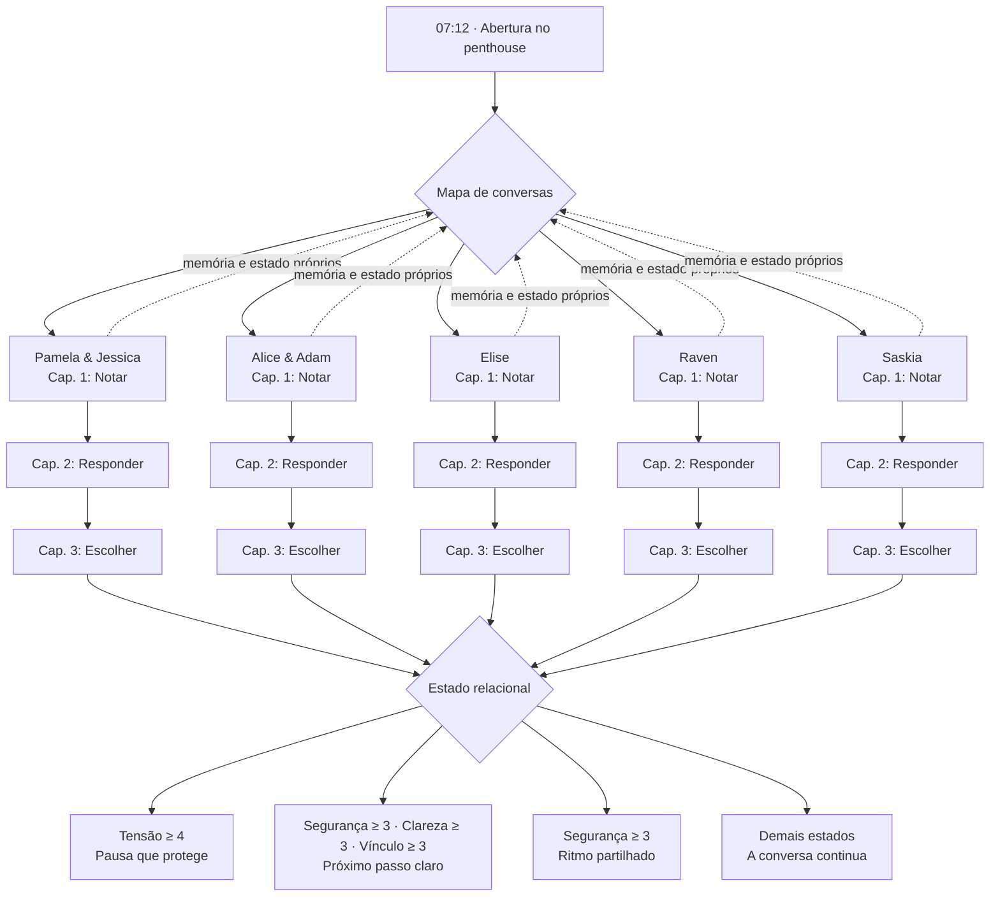
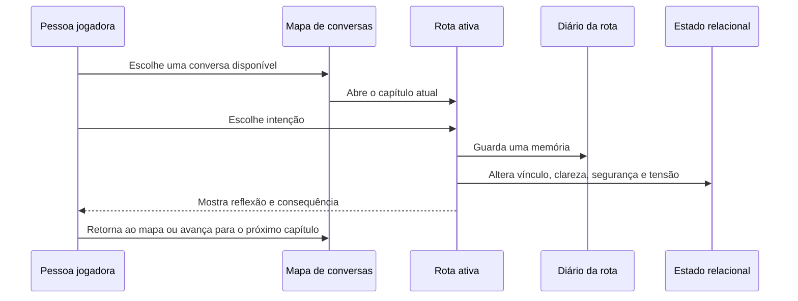
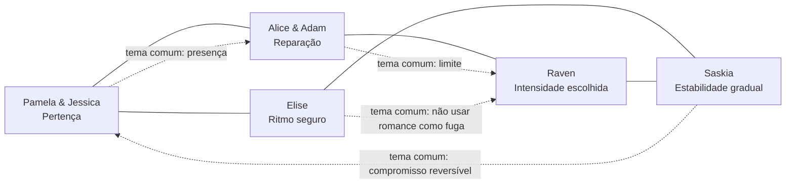

# The Croe Trio — Timeline de Conversas e Rumos Possíveis

> **Leitura rápida:** o jogo começa numa manhã no penthouse e abre um mapa com cinco conversas. A pessoa jogadora pode alternar livremente entre as rotas; cada uma avança internamente de **Notar** para **Responder** e, por fim, **Escolher**. As escolhas deixam memórias, alteram quatro atributos e conduzem a um epílogo próprio.

## 1. Estrutura geral

O tempo diegético não é estritamente linear depois da abertura. O primeiro bloco do Croe Trio e a conversa com Alice & Adam acontecem na mesma manhã; Elise, Raven e Saskia ocupam outros momentos da semana. No jogo atual, a pessoa jogadora escolhe a **ordem de visita** através do mapa de conversas. Cada rota, contudo, mantém a sequência interna dos seus três capítulos.

## 2. Linha temporal narrativa

| Janela narrativa | Conversa possível | Capítulos | Questão central | Relações que ecoam a cena |
|---|---|---|---|---|
| **07:12, penthouse** | **Pamela & Jessica** | O sofá às 07:12 → O que pertence a todos → A manhã seguinte | Como pertencer ao núcleo sem apagar ninguém? | Alice & Adam permanecem como contexto; a conversa define o tom do apartamento. |
| **07:18–fim da tarde, penthouse** | **Alice & Adam** | A porta entreaberta → Responsabilidade concreta → O que vem depois | Reparar exige mudança observável ou é preciso escolher uma pausa? | O Croe Trio é o contexto emocional imediato; a decisão afeta a disponibilidade da pessoa jogadora para outras conversas. |
| **Fim de tarde até noite, Soleil Café** | **Elise** | O café depois da chuva → O ritmo da mesa junto à janela → Uma cadeira para dois | É possível começar algo sem usar a relação como fuga? | A tensão do penthouse aparece como subtexto, mas Elise não deve ser tratada como solução para ela. |
| **Depois da meia-noite, Clube Violeta** | **Raven** | Música atrás da porta → Luzes acesas → Depois da última música | Como escolher intensidade sem transformar desejo em obrigação? | A rota confronta a tentação de desaparecer nas outras relações ou no impulso. |
| **Dias seguintes, estação e bairro** | **Saskia** | Debaixo do mesmo guarda-chuva → Coisas pequenas → Uma chave que não é promessa | Como experimentar estabilidade sem apressar um futuro? | A rota espelha os temas de consistência e presença que surgem no penthouse. |

## 3. Ciclo de uma rota

Cada rota contém três conversas sequenciais. Uma escolha é feita por capítulo e registra uma memória; em seguida, o mapa reaparece, permitindo explorar outra rota antes de avançar.

## 4. As quatro intenções de escolha

| Intenção | Função narrativa | Efeito mecânico mais comum | Exemplo de uso |
|---|---|---|---|
| **Escutar** | Recebe o contexto da outra pessoa sem se apropriar dele. | Pode aumentar vínculo e segurança; frequentemente reduz tensão. | Perguntar a Pamela e Jessica de que precisam para não se perderem uma na outra. |
| **Perguntar** | Cria linguagem para uma necessidade, limite ou expectativa. | Aumenta sobretudo clareza; pode elevar tensão quando toca numa ferida. | Perguntar a Alice quando ela percebeu a solidão da pessoa jogadora. |
| **Ser honesto** | Nomeia um medo, desejo ou impacto sem decidir pelo outro. | Pode aumentar vínculo e clareza; às vezes traz tensão temporária. | Dizer a Raven que a ligação assusta, mas não será fingida. |
| **Dar espaço** | Protege o tempo, a pausa e a possibilidade de recusa. | Aumenta segurança; em geral reduz tensão. | Deixar a chave de Saskia no envelope até o gesto ser seguro para todos. |

## 5. Atributos e desfechos

Os valores são **independentes por rota**. Resolver algo com Elise não muda automaticamente os valores de Pamela & Jessica, Alice & Adam, Raven ou Saskia no código atual. Isto evita que uma pessoa seja usada como recurso para “consertar” outra relação.

| Atributo | Estado inicial mais relevante | Leitura na timeline |
|---|---|---|
| **Vínculo** | O Croe Trio inicia em 2; as demais rotas iniciam em 1. | Mede disponibilidade, calor e vontade de continuar presente. |
| **Clareza** | Todas as rotas iniciam em 1. | Mede a capacidade de nomear necessidades, ritmos e formatos. |
| **Segurança** | Elise inicia em 3; Alice & Adam em 1; as demais entre 2 e 3. | Mede se limites, recusas e pausas podem existir sem punição. |
| **Tensão** | Alice & Adam iniciam em 4; Croe Trio em 3; as outras entre 1 e 2. | Mede feridas e atritos que pedem cuidado, não uma “falha”. |

### Regras exatas do epílogo

| Condição verificada ao fim do capítulo 3 | Rumo possível | Significado dramático |
|---|---|---|
| **Tensão ≥ 4** | **Uma pausa que protege** | A relação não é decidida agora; o limite nomeado é respeitado. |
| **Segurança ≥ 3, Clareza ≥ 3 e Vínculo ≥ 3** | **Um próximo passo claro** | Existe base suficiente para uma aproximação escolhida, sem apagar o passado. |
| **Segurança ≥ 3**, sem cumprir a condição acima | **Ritmo partilhado** | A relação segue, mas sem pressionar uma definição prematura. |
| **Qualquer outro estado** | **A conversa continua** | A conversa abre caminho para uma próxima cena, sem forçar fechamento. |

## 6. Memórias que conectam capítulos

Cada escolha cria uma memória no diário da **própria rota**. O capítulo seguinte mostra a última memória, e o mapa resume a última que foi registrada. Estes são alguns exemplos de memórias que já existem no jogo:

| Rota | Exemplos de memória | Como direcionam a leitura da rota |
|---|---|---|
| Pamela & Jessica | “Nomeaste a ausência sem culpar ninguém.”; “Pediste pertença sem a transformar em direito.” | Desloca o foco de posse para reconhecimento e rotina de presença. |
| Alice & Adam | “Definiste uma condição para a conversa.”; “Propuseste mediação antes que a conversa se tornasse defesa.” | Mantém reparação separada de perdão automático. |
| Elise | “Separaste alívio de promessa.”; “Quiseste um encontro sem o usar como fuga.” | Distingue cuidado, descanso e romance. |
| Raven | “Criaste uma palavra de pausa.”; “Mantiveste as outras relações visíveis.” | Separa intensidade, consentimento e isolamento. |
| Saskia | “Ofereceste consistência sem prometer certeza absoluta.”; “Deixaste a chave no envelope.” | Faz estabilidade significar escolha reversível e conversa contínua. |

## 7. Cruzamentos entre conversas

### Cruzamentos já implementados

O jogo atual possui **cruzamentos temáticos e cronológicos**, não gatilhos numéricos entre rotas. A pessoa jogadora pode abrir qualquer conversa pelo mapa, voltar depois de cada reflexão e carregar memórias separadas por rota. O penthouse é a âncora temporal; Elise, Raven e Saskia são conversas paralelas que exploram maneiras distintas de responder à crise inicial.

### Cruzamentos recomendados para uma próxima expansão

Estes cruzamentos **ainda não estão codificados**. Eles funcionam como proposta de escrita para capítulos 4–5, sem contradizer as mecânicas atuais.

| Conexão futura | Gatilho narrativo sugerido | Efeito dramático possível |
|---|---|---|
| **Croe Trio ↔ Alice & Adam** | A pessoa jogadora escolhe “nomear ausência” com Pamela & Jessica e depois “mudança observável” com Alice & Adam. | Abre uma cena de acordos de casa, sem exigir que as relações tenham o mesmo formato. |
| **Elise ↔ Raven** | Elise registra “não usar como fuga” e Raven registra “manter outras relações visíveis”. | Abre uma conversa sobre desejo que não isola nem substitui a rede de apoio. |
| **Saskia ↔ Croe Trio** | Saskia recebe uma escolha de rotina segura e o Trio opta por uma manhã semanal de conversa. | Abre uma cena sobre consistência: calendário, consentimento e espaço pessoal. |
| **Alice & Adam ↔ todas as rotas** | A pessoa jogadora escolhe pausa ou mediação. | Modifica o tom de capítulos posteriores, tornando explícito que a reconstrução não pode ser terceirizada para novos vínculos. |

## 8. Roteiro de leitura sugerido

Esta não é uma ordem obrigatória; é uma sequência útil para testar a variedade emocional do jogo.

1. Começar por **Pamela & Jessica — capítulo 1**, escolhendo uma intenção que nomeie o que ficou em silêncio.
2. Visitar **Alice & Adam — capítulo 1** para estabelecer limites ou reconhecer o impacto da ausência.
3. Alternar para **Elise** ou **Saskia** para explorar cuidado e estabilidade sem “fugir” da conversa inicial.
4. Visitar **Raven** quando for relevante testar intensidade, autonomia e a palavra de pausa.
5. Retomar o **Croe Trio — capítulos 2 e 3** depois de ter acumulado outras perspetivas no mapa.
6. Concluir uma rota e ler o epílogo como consequência do estado daquela relação, não como classificação moral da escolha.

## 9. Limites de escopo atuais

O documento descreve o que já existe no motor narrativo: cinco rotas, três capítulos em cada uma, atributos por rota, memórias e epílogos condicionais. Não existem, ainda, guardado persistente entre sessões, capítulos 4–5, diálogos reescritos por memórias de outras rotas ou alterações de atributo cruzadas. As propostas de cruzamento da secção 7 são um mapa para a próxima expansão, não comportamento já disponível no jogo.
