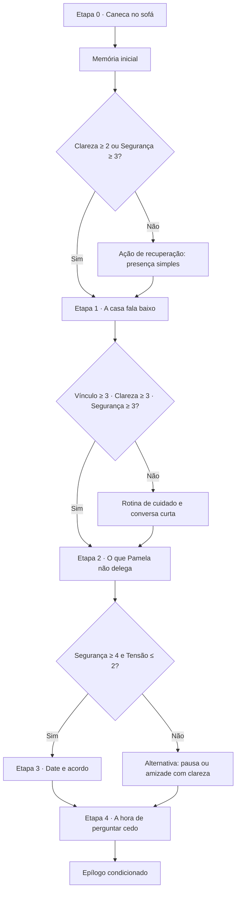
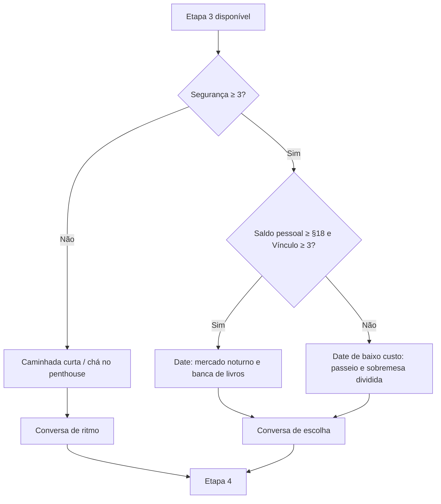

# Rota Expandida de Pamela — Plano de Uma Hora

| Campo | Definição |
|---|---|
| **Título de trabalho** | **Aqui, Antes de Ser Tarde** |
| **Foco da rota** | Pamela aprende a pedir presença sem carregar toda a organização emocional da casa; a pessoa jogadora aprende a aparecer sem tomar o controle. |
| **Formato** | Romance relacional em cinco etapas, alternando conversa, rotina, cuidado, escolhas e dates leves. |
| **Duração do primeiro percurso** | **65–75 minutos**, considerando leitura, escolhas, dois a três blocos de rotina e um epílogo. |
| **Relação com Jessica** | Jessica continua importante para o contexto do trio, mas Pamela possui objetivos, limites e cenas individuais; a rota não exige que Pamela escolha entre a pessoa jogadora e Jessica. |
| **Escopo** | Documento de design. Nenhuma alteração de código é prevista nesta etapa. |

> **Promessa da rota:** “Quando Pamela diz que está bem, a pergunta não é como convencê-la a abrir-se. É como construir condições para que ela não precise se sustentar sozinha.”

## 1. Arco emocional

A rota parte de uma Pamela cuidadora, observadora e funcional, que costuma antecipar necessidades alheias antes de reconhecer as próprias. O conflito não é falta de sentimento; é a assimetria de presença. Ela teme que pedir apoio pareça cobrar demais, enquanto a pessoa jogadora teme ocupar um lugar que não lhe foi oferecido. O arco chega a uma forma de intimidade prática: acordos pequenos, atenção explícita e escolhas reversíveis.

| Movimento | Pergunta dramática | Transformação desejada |
|---|---|---|
| **Notar** | O que Pamela tem sustentado em silêncio? | A pessoa jogadora reconhece o trabalho emocional sem tentar resolvê-lo por ela. |
| **Perguntar** | O que é cuidado para Pamela, e o que é invasão? | A rota cria linguagem para limites, ajuda e presença. |
| **Praticar** | É possível aparecer de forma consistente em dias comuns? | Rotina e ações de cuidado testam intenção no mundo concreto. |
| **Escolher** | Que forma de proximidade é segura agora? | Pamela e a pessoa jogadora definem um próximo passo, uma pausa ou uma amizade íntima com clareza. |

## 2. Duração e cadência

Cada etapa funciona como uma **história curta**, com começo, tensão e resolução parcial. Entre as etapas, a rota volta ao penthouse — o mundo-base do jogo — para mostrar que intimidade só se consolida quando atravessa a vida comum, e não apenas cenas especiais.

| Etapa | Conteúdo | Tempo estimado |
|---|---|---:|
| **0. Primeiro gesto** | Conversa de abertura no sofá, memória inicial e escolha de intenção. | 8 min |
| **1. A casa fala baixo** | Dois blocos de rotina, ação de cuidado e conversa curta na cozinha. | 12–14 min |
| **2. O que Pamela não delega** | Cena de conflito, favor contextual e escolha sobre pedir ajuda. | 13–15 min |
| **3. Um encontro que não conserta nada** | Date curto ou alternativa de baixo custo, com retorno à casa. | 12–14 min |
| **4. A hora de perguntar cedo** | Conversa de compromisso, avaliação de estados e epílogo. | 15–18 min |
| **Total** | Primeiro percurso, sem repetir cenas opcionais. | **65–75 min** |

## 3. Estado inicial e limiares

Para esta rota individual, Pamela usa uma camada de estado própria. Os valores abaixo são metas de design; eles podem ser traduzidos posteriormente para o sistema global sem substituir a rota atual do Croe Trio.

| Atributo | Estado inicial | Interpretação |
|---|---:|---|
| **Vínculo** | 2/5 | Há afeto e atenção, mas Pamela ainda não confia que a presença será consistente. |
| **Clareza** | 1/5 | Os limites e a forma da relação ainda não foram nomeados com precisão. |
| **Segurança** | 2/5 | Pamela aceita aproximação, mas precisa saber que um “não”, uma pausa ou um pedido não serão cobrados. |
| **Tensão** | 3/5 | A carga acumulada da casa e o receio de exclusão ainda estão presentes. |

### Lógica de desbloqueio

| Etapa | Requisito para abrir | Ações que passam a estar disponíveis | Bloqueio saudável |
|---|---|---|---|
| **0 → 1** | Concluir a conversa inicial. | Chá partilhado, mensagem de check-in, arrumar a varanda. | Nenhum; toda escolha abre a etapa 1. |
| **1 → 2** | Clareza ≥ 2 **ou** Segurança ≥ 3; Tensão ≤ 3. | Cozinhar com Pamela, ajudar a organizar a semana, pedir um favor contextual. | Se Tensão ≥ 4, abre uma conversa de reparação em vez de um date. |
| **2 → 3** | Vínculo ≥ 3, Clareza ≥ 3 e Segurança ≥ 3. | Date de baixo custo, presente contextual, passeio de fim de tarde. | Se Segurança < 3, a rota oferece apenas cuidado não romântico e espaço. |
| **3 → 4** | Segurança ≥ 4 e Tensão ≤ 2. | Planejar rotina semanal, encontro íntimo não sexual, decisão de proximidade. | Se os valores não fecharem, a etapa final ainda ocorre como acordo de pausa ou amizade clara. |

## 4. Princípios de bloqueio e recuperação

O sistema nunca bloqueia a rota por falta de dinheiro ou por uma escolha isolada. A rota muda de forma: uma cena de date pode virar caminhada sem custo; um presente pode virar uma pergunta; uma tensão elevada abre reparação, não game over.

| Situação | Resposta do design |
|---|---|
| **Dinheiro pessoal insuficiente** | Oferecer ação gratuita de cuidado, passeio ou tarefa compartilhada. |
| **Energia baixa** | Permitir descanso, mensagem honesta ou agendamento explícito, em vez de exigir produtividade emocional. |
| **Tensão alta** | Suspender presentes e dates; desbloquear conversa de limite, pedido de desculpa específico ou pausa. |
| **Segurança baixa** | Não permitir gesto surpresa; pedir contexto e consentimento passa a ser a ação principal. |
| **Clareza baixa no final** | Conduzir a um epílogo de continuação aberta, não a uma promessa ambígua. |

## 5. Fluxo de alto nível

## 6. Resultados possíveis

| Resultado | Requisito de estado | Significado |
|---|---|---|
| **Rotina a dois** | Vínculo ≥ 4, Clareza ≥ 4, Segurança ≥ 4, Tensão ≤ 1. | Pamela e a pessoa jogadora iniciam uma rotina de cuidado e dates claros, sem apagar o restante do núcleo. |
| **Proximidade escolhida** | Vínculo ≥ 3, Clareza ≥ 3, Segurança ≥ 4. | Existe afeto e vontade de explorar romance devagar, com check-ins explícitos. |
| **Amizade íntima e honesta** | Segurança ≥ 3, mas Vínculo ou Clareza abaixo de 3. | A relação continua importante sem ser chamada de romance antes da hora. |
| **Pausa que preserva** | Tensão ≥ 3 ou Segurança ≤ 2 no encerramento. | Pamela e a pessoa jogadora escolhem espaço com data de revisão e sem punição. |

## 7. Mapa de conteúdo e tempo de jogo

O percurso de uma hora é desenhado para uma primeira partida sem leitura apressada. A estimativa considera diálogo, a leitura dos resultados de cada escolha, navegação do quadro de rotina e pelo menos três ações entre cenas. Conteúdo opcional acrescenta 10 a 18 minutos, mas não é necessário para alcançar a duração prometida.

| Bloco | Cena principal | Interação de rotina | Duração-base | Conteúdo opcional |
|---|---|---|---:|---:|
| **0** | **Caneca no sofá** | Escolha de intenção inicial. | 8 min | 0 min |
| **1** | **A casa fala baixo** | Mensagem, chá, varanda ou ingredientes. | 14 min | 4 min |
| **2** | **O que Pamela não delega** | Favor contextual ligado à casa. | 16 min | 5 min |
| **3** | **Um encontro que não conserta nada** | Date breve, caminhada ou cuidado alternativo. | 14 min | 4 min |
| **4** | **A hora de perguntar cedo** | Escolha de rotina, pausa ou próximo encontro. | 16 min | 5 min |
| **Total** | Cinco histórias curtas conectadas pelo penthouse. | Mínimo de três ações e dois retornos à casa. | **68 min** | **18 min** |

## 8. Etapa 0 — Caneca no sofá

### Objetivo dramático

Pamela oferece uma caneca e deixa espaço no sofá, sem pressupor que a pessoa jogadora vai aceitá-la. A cena estabelece que a proximidade não é automática, mesmo quando já existe história entre as pessoas. Jessica pode aparecer ao fundo, mas a atenção narrativa permanece em Pamela: ela observa se a pessoa jogadora pergunta, nomeia a ausência ou tenta decidir um formato rápido demais.

### Estrutura de cena

| Movimento | Conteúdo | Consequência de estado |
|---|---|---|
| **Início** | Pamela oferece a caneca e pergunta apenas: “Você quer companhia ou silêncio?” | Nenhuma alteração; a pergunta introduz consentimento de presença. |
| **Escolha** | Escutar o que a manhã significa; perguntar o nome da relação; ou nomear a sensação de ter ficado de fora. | Clareza, segurança e tensão se alteram conforme a intenção escolhida. |
| **Resposta de Pamela** | Pamela reconhece que cuidado não pode ser presumido e pergunta o que seria útil naquela manhã. | Cria a primeira memória e libera o quadro de rotina. |
| **Fechamento** | A pessoa jogadora decide se aceita a caneca, deixa-a na mesa ou pede alguns minutos. | Define a textura do primeiro retorno ao penthouse, sem bloquear conteúdo. |

### Escolhas e efeitos propostos

| Escolha | Intenção | Efeito | Memória |
|---|---|---|---|
| “Quero entender o que você tem carregado hoje.” | Escutar | +1 Clareza, +1 Segurança, −1 Tensão | **Você perguntou antes de preencher o silêncio de Pamela.** |
| “Eu não sei que nome dar a isto; queria falar sem decidir agora.” | Perguntar | +2 Clareza, +1 Tensão | **Você pediu linguagem sem exigir uma definição.** |
| “Eu me senti de fora, mas não quero usar isso para cobrar um lugar.” | Ser honesto | +1 Vínculo, +1 Clareza, −1 Tensão | **Você nomeou a falta sem transformar presença em direito.** |

> **Regra de escrita:** Pamela não responde com uma recompensa romântica imediata. Ela agradece uma forma de presença, esclarece uma necessidade ou marca um limite. A pessoa jogadora recebe um caminho, não uma garantia.

## 9. Etapa 1 — A casa fala baixo

### Objetivo dramático

Esta etapa mostra que cuidado é uma prática concreta. Pamela está com a semana organizada em listas, mas uma lista contém tarefas de todos que acabaram no colo dela. A pessoa jogadora não deve “salvar” Pamela; deve perceber onde pode oferecer ajuda, perguntar o que é bem-vindo e cumprir um gesto pequeno sem pedir retorno.

### Retorno ao mundo-base

O jogo volta ao penthouse em duas janelas de rotina — manhã e tarde. A pessoa jogadora escolhe até duas ações antes da conversa da cozinha. A variedade é importante: trabalho pode ser necessário para quem deseja comprar ingredientes, mas nunca é requisito para avançar.

| Ação disponível | Custo | Requisito | Efeito possível em Pamela | Observação de design |
|---|---:|---|---|---|
| **Mensagem de check-in** | 0 energia / §0 | Nenhum | +1 Clareza *ou* +1 Segurança | Pergunta se ela quer ajuda, não se ela “está bem”. |
| **Preparar chá e torradas** | 1 energia / §0 | Concluir etapa 0 | +1 Vínculo | Gesto simples; pode falhar em impacto se for oferecido como desculpa. |
| **Arrumar a varanda** | 1 energia / §0 | Segurança ≥ 2 | −1 Tensão | Pamela precisa concordar que a varanda pode ser mexida. |
| **Comprar ingredientes frescos** | 0 energia / §12 | Saldo pessoal ≥ §12 | Habilita cozinhar juntos na etapa 2. | Item habilita uma cena; não concede ponto sozinho. |
| **Turno remoto** | 1 energia / +§35 | Nenhum | Nenhum direto | Cria recurso sem obrigar ausência total do penthouse. |

### Cena: “As listas que ninguém pediu”

Na cozinha, Pamela confere uma lista de compras, contas e mensagens não respondidas. Ao perceber que a pessoa jogadora a observa, ela diz que consegue resolver; em seguida, admite que diz isso antes de perceber se alguém realmente poderia ficar.

| Escolha | Consequência narrativa | Efeito sugerido |
|---|---|---|
| “Qual dessas coisas você quer que continue sendo sua, e qual eu posso dividir?” | Reconhece autonomia antes de oferecer solução. | +2 Clareza, +1 Segurança |
| “Posso ficar aqui enquanto você termina; não preciso transformar isso em tarefa.” | Faz companhia sem administrar a cena. | +1 Vínculo, +1 Segurança, −1 Tensão |
| “Eu posso resolver tudo isso para você.” | Aciona um limite de Pamela e uma correção imediata. | −1 Clareza, +1 Tensão; abre cena de reparação curta. |

### Cena opcional: “Cinco minutos na varanda”

Se a pessoa jogadora arrumou a varanda ou enviou uma mensagem respeitosa, Pamela convida para ficar cinco minutos olhando a cidade. A cena não precisa de romance explícito: a escolha é falar de algo leve, perguntar como a semana pesa ou permanecer em silêncio consentido. Ela adiciona uma memória e aprofunda a ideia de que descanso também precisa ser protegido.

## 10. Etapa 2 — O que Pamela não delega

### Objetivo dramático

Pamela recebe uma mensagem sobre um problema prático da casa: uma cobrança confusa do condomínio, a visita de manutenção ou um compromisso de família que todos presumiram que ela lembraria. A tensão não vem do problema em si, mas da constatação de que Pamela tornou-se a pessoa que absorve o que ninguém quer organizar.

Esta etapa deve ser a mais longa da rota. Ela combina uma conversa de conflito, um favor contextual e uma escolha sobre responsabilidade partilhada. A pessoa jogadora pode errar tentando agir rápido; o avanço exige voltar à pergunta “o que você quer que eu faça?”.

### Desbloqueio e preparos

| Estado ao entrar | Variação de cena |
|---|---|
| **Clareza ≥ 2 e Segurança ≥ 3** | Pamela pede ajuda antes de entrar em sobrecarga; a cena começa com uma pergunta direta. |
| **Tensão = 3** | Pamela tenta resolver tudo sozinha; a pessoa jogadora percebe o problema observando a lista. |
| **Tensão ≥ 4** | A cena inicia com Pamela recusando ajuda. O primeiro objetivo é reparar o limite, não completar a tarefa. |
| **Ingredientes comprados** | Cozinhar juntos fica disponível após o favor e adiciona uma conversa breve de descompressão. |

### Favor contextual: escolha de abordagem

| Ação | Custo | Requisito | Resultado | Memória possível |
|---|---:|---|---|---|
| **Separar as cobranças e opções** | 1 energia / §0 | Pamela autoriza que a pessoa jogadora veja os papéis. | +1 Clareza, −1 Tensão | “Você tornou o problema legível antes de tentar resolvê-lo.” |
| **Fazer uma ligação prática juntos** | 1 energia / §0 | Segurança ≥ 3 | +1 Vínculo, +1 Clareza | “Você ficou na ligação sem tomar a voz de Pamela.” |
| **Assumir a tarefa sem perguntar** | 1 energia / §0 | Sempre disponível, mas desaconselhada. | +1 Tensão; abre reparação. | “Você confundiu iniciativa com permissão.” |
| **Cozinhar a refeição combinada** | 1 energia / ingredientes | Ingredientes no inventário e Favor concluído. | +1 Vínculo, +1 Segurança | “Você transformou uma tarefa em tempo de descanso partilhado.” |
| **Pedir que ela faça tudo e depois sair** | 0 energia / §0 | Sempre disponível. | −1 Vínculo, +1 Tensão; não termina a rota. | “Você deixou Pamela carregar a lista sozinha hoje.” |

### Cena: “A agenda é uma conversa”

Depois do favor, Pamela chama a pessoa jogadora para olhar a semana. Ela não quer promessas grandiosas; ela quer descobrir se pode perguntar cedo, antes de se ressentir. A cena oferece uma decisão entre uma rotina concreta, uma tentativa de compensação rápida e uma pausa para entender melhor os limites.

| Escolha | Efeito | Ramificação seguinte |
|---|---|---|
| “Vamos escolher uma coisa por semana que eu assumo, e rever se ainda ajuda.” | +2 Segurança, +1 Clareza | Libera date de baixo custo e rotina semanal. |
| “Eu prometo estar sempre disponível.” | +1 Vínculo, +1 Tensão | Pamela questiona a promessa; abre uma correção na etapa 3. |
| “Prefiro não decidir isso agora. Posso anotar o que percebi e voltar amanhã?” | +1 Clareza, +1 Segurança | Libera a rota de conversa lenta na etapa 3. |

## 11. Etapa 3 — Um encontro que não conserta nada

### Objetivo dramático

O date acontece apenas se os atributos indicarem que Pamela pode confiar na forma do convite. Ele não serve para “compensar” o conflito da etapa 2. É uma cena para testar se proximidade pode existir ao lado de limites, rotina e outros vínculos.

### Árvore de atividades

| Opção | Custo | Requisito | Cena | Efeito de design |
|---|---:|---|---|---|
| **Mercado noturno e banca de livros** | 1 energia / §18 | Vínculo ≥ 3, Segurança ≥ 3 | Pamela escolhe um livro e a pessoa jogadora pergunta se quer ouvi-la falar ou apenas caminhar. | Explora desejo compartilhado sem espetáculo. |
| **Sobremesa e caminhada curta** | 1 energia / §8 | Segurança ≥ 3 | As duas pessoas dividem uma sobremesa e combinam uma hora de retorno. | Demonstra que um date não precisa ser caro. |
| **Chá no penthouse** | 1 energia / §0 | Sempre disponível | Pamela escolhe a música e define a duração da conversa. | Alternativa íntima e não punitiva. |
| **Adiar com clareza** | 0 energia / §0 | Sempre disponível | A pessoa jogadora reconhece que está sem energia ou recursos e sugere outra data. | +Segurança quando explicado sem silêncio. |

### Cena: “Nada que uma noite resolva”

No meio do date, Pamela pergunta se a pessoa jogadora está esperando que a noite apague a conversa difícil. O conflito curto da etapa é resistir à tentação de transformar afeto em quitação de dívida.

| Escolha | Resultado narrativo | Efeito |
|---|---|---|
| “Não. Eu queria uma noite boa com você e ainda quero voltar à conversa difícil.” | Pamela relaxa; a relação suporta duas verdades ao mesmo tempo. | +2 Clareza, +1 Segurança, +1 Vínculo |
| “Talvez isto prove que estamos bem.” | Pamela corrige com gentileza: uma noite boa não é prova suficiente. | +1 Tensão; abre conversa de correção. |
| “Não sei. Posso parar de tentar dar a resposta certa e ouvir?” | Pamela escolhe o que precisa naquele momento. | +1 Segurança, +1 Vínculo |

### Conteúdo opcional: presente contextual

O **Livro anotado** pode ser comprado por §24 e oferecido apenas depois da conversa “Nada que uma noite resolva”. A pessoa jogadora deve perguntar se Pamela quer recebê-lo agora ou em outro momento. Se o presente for aceito, ele gera uma memória de atenção; se ela preferir não receber, respeitar a escolha gera Segurança +1. O item nunca é usado para desbloquear o melhor epílogo.

## 12. Etapa 4 — A hora de perguntar cedo

### Objetivo dramático

Pamela e a pessoa jogadora voltam à varanda do penthouse, desta vez com uma semana de pequenas ações, conversas e limites como referência. A pergunta final não é “o que somos?”, mas “como vamos perceber cedo quando algo começar a pesar?”. O jogo avalia os atributos, mas a cena verbaliza o estado para que o epílogo pareça consequência e não cálculo oculto.

### Estrutura da conversa final

| Movimento | Função |
|---|---|
| **Memórias** | Pamela cita duas ou três memórias da rota: um gesto que funcionou, uma conversa que ficou difícil e algo que ambas aprenderam. |
| **Limite atual** | Ela nomeia uma necessidade presente: tempo a sós, check-in semanal, ajuda de casa, desejo de date ou espaço. |
| **Escolha da pessoa jogadora** | A pessoa jogadora propõe uma rotina, pede uma pausa ou define uma amizade íntima sem fingir que está prometendo algo maior. |
| **Epílogo** | O jogo apresenta o rumo baseado em atributos e na última intenção escolhida. |

### Escolhas finais

| Escolha | Requisito recomendado | Efeito | Possíveis epílogos |
|---|---|---|---|
| **Criar uma rotina de check-in e uma tarefa escolhida por semana** | Segurança ≥ 4 | +1 Clareza, +1 Vínculo | Rotina a dois; Proximidade escolhida. |
| **Marcar um próximo date com espaço para cancelar ou ajustar** | Vínculo ≥ 3, Clareza ≥ 3 | +1 Segurança, +1 Vínculo | Proximidade escolhida; Amizade íntima. |
| **Dizer que preciso desacelerar, mas quero explicar e rever em uma semana** | Sempre disponível | −1 Tensão, +1 Segurança | Pausa que preserva; Amizade íntima. |
| **Prometer que nunca vou falhar com ela** | Sempre disponível, mas cria correção. | +1 Tensão | Pamela pede uma proposta menor e mais verdadeira; evita “final perfeito” artificial. |

## 13. Epílogos detalhados

### A. Rotina a dois

**Condições:** Vínculo ≥ 4, Clareza ≥ 4, Segurança ≥ 4, Tensão ≤ 1.

Pamela abre um documento simples de rotina: uma tarefa compartilhada, um check-in semanal e a possibilidade de trocar qualquer item sem justificar demais. A cena final não é uma declaração definitiva. É Pamela deixando uma chave da varanda acessível e dizendo que proximidade funciona melhor quando ninguém precisa adivinhar se pode chegar. A memória de encerramento é: **“Vocês criaram uma rotina que pode mudar sem desabar.”**

### B. Proximidade escolhida

**Condições:** Vínculo ≥ 3, Clareza ≥ 3, Segurança ≥ 4.

Pamela propõe um próximo encontro e pede que a pessoa jogadora escolha apenas uma coisa: dia, horário ou atividade. A escolha pequena garante que a decisão continua sendo compartilhada. A memória de encerramento é: **“Vocês escolheram continuar sem fingir que já sabem o final.”**

### C. Amizade íntima e honesta

**Condições:** Segurança ≥ 3, com Vínculo ou Clareza abaixo de 3.

Pamela reconhece que a relação importa mesmo sem um nome romântico pronto. Ela pede uma amizade que não desapareça quando o romance não é a resposta imediata. A memória de encerramento é: **“Vocês preservaram o cuidado sem transformá-lo em expectativa.”**

### D. Pausa que preserva

**Condições:** Tensão ≥ 3 ou Segurança ≤ 2.

Pamela diz que precisa de menos contato por alguns dias, mas não quer repetir o padrão de sumir. Ela e a pessoa jogadora escolhem uma data curta para rever a conversa, com a possibilidade real de estender a pausa. A memória de encerramento é: **“Vocês escolheram espaço antes que o silêncio virasse ferida.”**

## 14. Matriz de progresso e ações desbloqueadas

| Limiar | Conteúdo liberado | Intenção de design |
|---|---|---|
| **Clareza 2** | Perguntas diretas sobre ajuda, limites e divisão de tarefas. | Recompensa linguagem, não adivinhação. |
| **Segurança 3** | Favor contextual, ligação conjunta e sobremesa compartilhada. | Libera proximidade quando limites podem existir. |
| **Vínculo 3** | Mercado noturno, caminhada longa e cena opcional de livro. | Libera tempo de qualidade sem exigir romance imediato. |
| **Clareza 3 + Segurança 3** | Cena de planejamento semanal e date de baixo custo. | Conecta conversa a compromisso concreto. |
| **Segurança 4 + Tensão ≤ 2** | Escolhas de rotina a dois e epílogos de proximidade. | Privilegia estabilidade emocional em vez de gasto. |
| **Tensão 4+** | Conversa de reparação, pedido de espaço e alternativas gratuitas. | Impede que presente ou date contornem dano relacional. |

## 15. Memórias de rota

As memórias abaixo dão retorno imediato a cada ação e servem de matéria-prima para a conversa final. O jogo deve mencionar apenas as memórias relevantes à partida da pessoa jogadora; não é necessário listar todas.

| Tipo de ação | Memória proposta |
|---|---|
| Check-in respeitoso | “Você perguntou se Pamela queria ajuda antes de oferecê-la.” |
| Chá partilhado | “Você fez companhia sem pedir que Pamela transformasse descanso em conversa.” |
| Varanda consentida | “Você cuidou da varanda depois de perguntar o que podia mudar.” |
| Favor de organização | “Você tornou a tarefa legível antes de assumir uma solução.” |
| Cozinhar juntos | “Vocês cozinharam para ter uma noite menos pesada, não para apagar um conflito.” |
| Date simples | “Vocês escolheram uma hora de presença sem chamar isso de resposta para tudo.” |
| Presente aceito ou recusado | “Você perguntou se era um bom momento para o gesto.” |
| Pausa honesta | “Você escolheu explicar a distância antes que ela se tornasse silêncio.” |

## 16. Regras de repetição e balanceamento

Para evitar que a rota vire uma sequência de tarefas mecânicas, uma mesma ação de cuidado só oferece seu efeito completo uma vez por semana de jogo. Repetições ainda podem gerar texto de ambiente ou conforto, mas não aumentam atributos automaticamente. Uma conversa nova, uma necessidade expressa ou uma mudança de contexto pode renovar o efeito da ação.

| Risco | Regra de proteção |
|---|---|
| Cozinhar vira a ação “mais forte” | A primeira refeição combinada aumenta vínculo e segurança; repetições oferecem somente pequeno texto de acolhimento. |
| Trabalho domina o tempo | A rota sempre tem ao menos uma ação gratuita de cuidado por etapa. |
| Presente substitui conversa | Presentes são bloqueados ou neutros quando Clareza < 2 ou Segurança < 3. |
| Escolha negativa encerra conteúdo | Respostas inadequadas criam reparação, não rota morta. |
| Date parece prêmio | Date é uma cena de teste de ritmo, não a confirmação de romance. |

## 17. Critérios de aceitação para implementação futura

O conteúdo desta rota estará pronto para implementação quando cada cena, ação e epílogo atender aos critérios abaixo.

1. Cada fase deve ter uma cena principal, uma escolha de diálogo, uma consequência explícita e um retorno ao mundo-base do penthouse.
2. O primeiro percurso deve conter pelo menos 68 minutos estimados de leitura e interação, sem exigir repetição artificial de tarefas.
3. Cada ação de cuidado deve ter custo, contexto, consentimento e memória; nenhuma pode conceder “amor” diretamente.
4. O ramo de baixo recurso deve permitir concluir a rota com dignidade, usando conversa, caminhada, chá, descanso ou tarefa de casa.
5. A rota deve terminar em proximidade, amizade ou pausa de forma válida; romance não é o único desfecho de sucesso.
6. Jessica deve aparecer apenas onde o núcleo do trio é relevante, sem reduzir Pamela a uma extensão do vínculo entre outras pessoas.

## 18. Referências internas

[1] [Mecânicas Relacionais](./MECHANICS.md)  
[2] [Economia Relacional e Rotina](./ECONOMIA_RELACIONAL.md)  
[3] [Timeline e Rumos](./TIMELINE_E_RUMOS.md)  
[4] [Game Design Document](./GAME_DESIGN_DOCUMENT.md)  
[5] [Rota atual do jogo](./client/src/game/story.ts)
