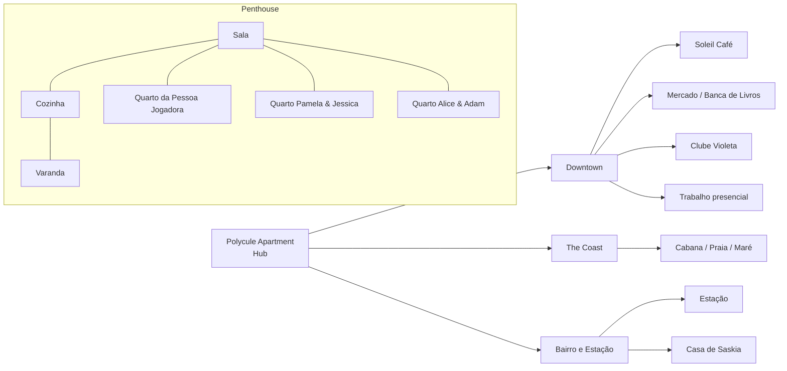
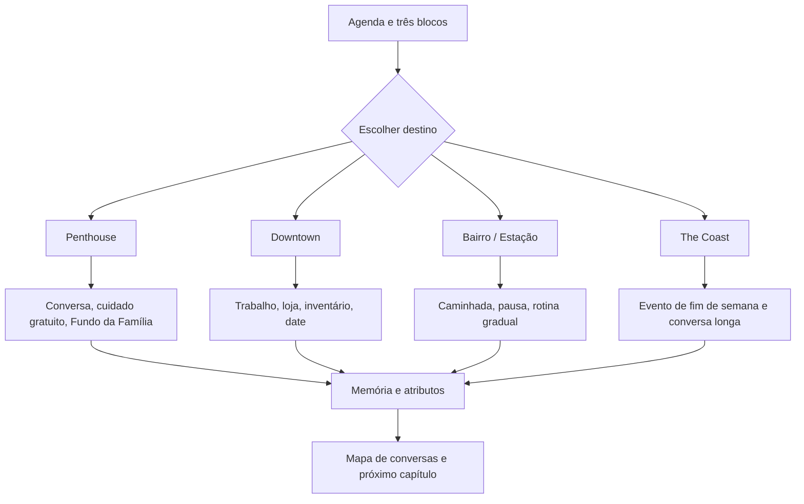

# Mapa do Jogo — The Croe Trio

| Campo | Definição |
|---|---|
| **Versão** | 1.0 |
| **Função** | Especificar locais, transições, janelas de tempo, sistemas disponíveis e relações que podem ocorrer em cada lugar. |
| **Regra central** | Um lugar deve oferecer uma decisão narrativa, uma ação de rotina ou uma possibilidade económica; nunca apenas um cenário decorativo. |
| **Hub principal** | Polycule Apartment, o penthouse que concentra as rotas domésticas, carteiras, inventário e calendário. |

> **Princípio do mapa:** deslocamento muda a pergunta disponível. A pessoa jogadora não viaja para “farmar” uma cena; viaja porque cada lugar permite um tipo específico de presença, cuidado, trabalho, compra, conversa ou pausa.

## 1. Visão geral de regiões

## 2. Regras de deslocamento

| Transição | Custo de tempo | Custo de energia | Regra de disponibilidade | Motivo de design |
|---|---:|---:|---|---|
| Entre cômodos do penthouse | 0 blocos | 0 | Sempre disponível, salvo limite narrativo. | A casa precisa permitir conversa e cuidado de baixo custo. |
| Penthouse ↔ Downtown | 1 bloco | 0 | Manhã, tarde ou noite; a cena de destino consome a janela. | Obriga a pessoa jogadora a escolher onde quer estar. |
| Penthouse ↔ Bairro / Estação | 1 bloco | 0 | Manhã ou tarde; noite somente em evento específico. | Separa rotina gradual de nightlife. |
| Penthouse ↔ The Coast | 1 bloco de ida e 1 de volta | 1 | Evento de fim de semana ou convite desbloqueado. | Faz o litoral parecer uma escolha de compromisso, não deslocamento gratuito. |
| Downtown ↔ Club Violeta | 0 blocos adicionais | 0 | Somente noite e com energia suficiente para a cena. | Permite encadear trabalho/café e vida noturna em um mesmo distrito. |
| Aplicativo de telefone | 0 blocos | 0 | Sempre disponível fora de conversa crítica. | Acessa carteiras, Crescent Market, agenda e mensagens sem criar um “local físico” artificial. |

## 3. Polycule Apartment — hub de sistemas

O penthouse é o mundo-base. Ele possui janelas de manhã, tarde e noite, e cada cômodo deve oferecer uma forma de participar sem custo financeiro. O retorno recorrente a esse espaço mostra consequências da rotina no cotidiano, em vez de deixá-las presas a dates especiais.

| Local | Personagens e cenas | Sistemas disponíveis | Gatilhos e transições |
|---|---|---|---|
| **Sala** | Abertura, conversas de núcleo, check-ins e reflexões de rota. | Mapa de conversas, memória recente, pausa, mensagens. | Sai para cozinha, varanda, quartos ou Downtown. |
| **Cozinha** | Café da manhã, receitas, sobremesa compartilhada e cenas de comida. | Inventário de ingredientes, Fundo da Família em refeição coletiva, ação de cozinhar. | Ingredientes + energia 1 liberam cuidado; pode chamar Pamela se ela aceitar. |
| **Varanda** | Conversas de compromisso, observação da cidade e epílogos. | Check-in, conversa de clareza, plano semanal. | Usa um bloco somente se a conversa for profunda; pode ser gratuita. |
| **Quarto da pessoa jogadora** | Descanso, mensagens, planejamento e limite de energia. | Descansar, agenda, carteira pessoal, Crescent Market. | Não é espaço automático para cenas íntimas; qualquer visita precisa de convite explícito. |
| **Quarto Pamela & Jessica** | História compartilhada, transparência e memórias fundadoras. | Cena de lembrança, conversa opt-in com Jessica, item contextual. | Entrada só com convite de Pamela ou Jessica; Segurança e Clareza determinam a cena. |
| **Quarto Alice & Adam** | Reparação de Alice & Adam e estado do núcleo. | Conversas de responsabilidade e pausa. | Não altera Pamela diretamente, mas pode criar contexto de casa para conversa coletiva. |

## 4. Downtown — economia, dates e trabalho

Downtown concentra sistemas de carteira pessoal, loja e trabalho. Ele deve permitir uma cena de baixo custo em toda janela, para que a falta de dinheiro nunca elimine a agência da pessoa jogadora.

| Local | Sistemas centrais | Rotas relacionadas | Uso na rota de Pamela |
|---|---|---|---|
| **Soleil Café** | Trabalho remoto/híbrido, pausa, conversa curta, café. | Elise; rotas de recuperação de todas as personagens. | Lugar para trabalhar antes de responder a Pamela ou encontrar um aroma/sabor que ela mencionou. Não substitui o date dela. |
| **Mercado de bairro** | Loja, ingredientes, presentes contextuais, sobremesa. | Pamela, Saskia e núcleo do trio. | Pamela escolhe sabores, uma lembrança para Jessica ou uma sobremesa coletiva. Gasto só habilita cena; não concede atributo isolado. |
| **Banca de livros e velas** | Presente contextual, date de curiosidade, memória de gosto. | Pamela, Elise e Raven. | Date padrão de Pamela; exige Segurança 3 e Vínculo 3, ou vira caminhada sem compra. |
| **Trabalho presencial** | Turno de 2 energia, +§60 pessoal. | Todas as rotas pelo calendário. | Cria saldo, mas pode consumir uma janela combinada com Pamela. Explicar o conflito de agenda pode elevar Segurança. |
| **Clube Violeta** | Vida noturna, música, socialização e rota de Raven. | Raven; ecos indiretos para o núcleo. | Não é local principal de Pamela. Uma visita só entra na rota se Pamela expressar interesse ou se a conversa tratar de exclusividade/tempo. |

## 5. Bairro, Estação e The Coast

| Local | Tempo preferencial | Sistemas | Rotas e transições |
|---|---|---|---|
| **Estação** | Manhã ou tarde. | Caminhada, pausa, mensagens e transporte para o bairro. | Saskia; também serve de alternativa gratuita a um date quando Pamela pede espaço ou contato curto. |
| **Casa de Saskia** | Tarde ou início da noite. | Rotina pequena, plantas, sopa e limites de visita. | Saskia; não deve funcionar como fuga imediata após conflito com Pamela. |
| **The Coast** | Fim de semana, manhã ou tarde. | Evento de viagem, piquenique, caminhada, fotos e conversa longa. | Pode se tornar date de curiosidade de Pamela após Clareza 3 e Segurança 3; também recebe eventos de grupo. |
| **Cabana da costa** | Fim de semana; requer recurso de grupo ou convite narrativo. | Fundo da Família, cozinha coletiva e conversa de núcleo. | Espaço para Pamela, Jessica e pessoa jogadora falarem de transparência em contexto menos claustrofóbico. |

## 6. Mapa de sistemas sobre lugares

## 7. Transições específicas para Pamela

| De | Para | Gate | Cena / sistema ativado | Estado que pode mudar |
|---|---|---|---|---|
| Sala | Quarto Pamela & Jessica | Convite de Pamela; Segurança ≥ 2. | **A camiseta emprestada** ou memória do vínculo Pamela–Jessica. | Clareza, Segurança. |
| Cozinha | Varanda | Pamela aceita ficar alguns minutos. | Bebida escolhida por cheiro, conversa curta, check-in. | Vínculo, Segurança. |
| Penthouse | Mercado | Tempo livre e interesse de Pamela em sabor, lembrança ou sobremesa. | Ingredientes, presente contextual para Jessica, sobremesa de núcleo. | Clareza; Vínculo só depois da cena. |
| Penthouse | Banca de livros | Segurança ≥ 3 e Vínculo ≥ 3 para date padrão. | **Date de curiosidade**. | Vínculo, Clareza, Segurança. |
| Penthouse | The Coast | Fim de semana + Clareza ≥ 3 + Segurança ≥ 3. | Caminhada, praia, conversa sobre nova geometria. | Clareza, Tensão. |
| Varanda | Sala / quarto compartilhado | Pamela escolhe conversa conjunta. | Transparência com Jessica, sem pedido de permissão. | Clareza, Segurança, Tensão. |
| Qualquer local | Quarto da pessoa jogadora | Energia baixa ou necessidade de limite. | Descanso e mensagem de adiamento. | Segurança ou Tensão, conforme comunicação. |

## 8. Gates de tempo e conteúdo

| Condição | Efeito sobre o mapa |
|---|---|
| **Energia 0** | Apenas descanso, mensagem, agenda, carteiras e conversa breve em espaço comum. |
| **Saldo pessoal < §8** | Mercado e date padrão continuam visíveis, mas a rota destaca caminhada, chá e conversa como alternativas completas. |
| **Segurança de Pamela ≤ 2** | Quarto compartilhado, date e presente contextual não iniciam cena de intimidade; mapa sugere espaço comum e pergunta aberta. |
| **Tensão de Pamela ≥ 4** | Destinos de date convertem-se em reparação, caminhada com hora marcada ou pausa; Clube e Coast ficam indisponíveis para a rota. |
| **Clareza de Pamela ≥ 3** | Mercado, varanda e quarto compartilhado recebem opções de transparência com Jessica. |
| **Fim de semana** | The Coast e cabana podem receber convite; Fundo da Família pode financiar encontro de núcleo, não presente individual. |

## 9. Regras de expansão do mapa

Um novo local só deve ser criado se apresentar ao menos uma função que não exista em outro lugar. Todo local deve declarar: janela de tempo, custo de deslocamento, sistemas ativos, personagens, ação gratuita, ação económica e uma consequência de rota.

| Tipo de local futuro | Exemplo | Função inédita necessária |
|---|---|---|
| Espaço de trabalho | Estúdio, oficina ou coworking. | Trabalho alternativo, favor profissional ou conversa sobre ambição. |
| Espaço cultural | Cinema de repertório, galeria ou show pequeno. | Date com escolha de interpretação e memória artística. |
| Espaço de cuidado | Jardim comunitário ou cozinha solidária. | Ação de cuidado coletivo que não se reduz ao Fundo da Família. |
| Espaço de transição | Ônibus noturno, lavanderia ou corredor do prédio. | Conversa curta, observação e decisão de tempo limitado. |

## 10. Critérios de aceite do mapa

1. Nenhum destino deve ser obrigatório para manter uma rota saudável; o penthouse sempre oferece uma alternativa gratuita e significativa.
2. Viagem não pode ser usada para contornar gates de Segurança, Clareza ou Tensão.
3. Loja, Carteira e Crescent Market devem operar pelo telefone ou por pontos lógicos do mapa, sem existir como lugares arbitrários.
4. Ações de um local devem produzir uma memória, uma oportunidade futura ou uma consequência económica clara.
5. Para Pamela, The Coast, Mercado e Banca de Livros devem reforçar curiosidade, transparência e lealdade a Jessica, nunca competição ou exclusividade implícita.
