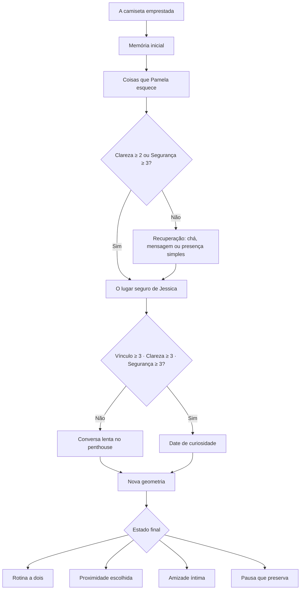

# Game Design Document — Rota de Pamela Riverra

| Campo | Definição |
|---|---|
| **Versão** | 1.0 — planejamento narrativo, sem alteração de código |
| **Título de trabalho** | **A Geometria do Calor** |
| **Formato** | Rota individual de date sim dentro de um polycule, com rotina, escolhas relacionais e economia leve |
| **Duração do primeiro percurso** | **68–75 minutos**, com 10–18 minutos opcionais |
| **Personagem focal** | Pamela Riverra, 26 anos, mulher bissexual |
| **Ponto de partida** | Pamela já percebe uma atração nova e intensa pela pessoa jogadora; o desafio é dar forma a essa conexão sem esconder, substituir ou diminuir seus vínculos fundadores. |
| **Escopo** | Este documento define conteúdo, lógica e critérios de implementação. Não altera código nem comportamento atual do jogo. |

> **Promessa da rota:** Pamela já quer se aproximar. O jogo não pergunta “como conquistá-la?”, mas “como responder a uma aproximação real sem transformá-la em segredo, posse ou dívida?”.

## 1. Visão e intenção de design

**A Geometria do Calor** é uma rota de romance adulto sobre curiosidade, presença sensorial e transparência afetiva. Pamela não é uma personagem distante que precisa ser convencida a sentir algo; ela já está em movimento. Sua gentileza, curiosidade e lealdade fazem com que procure a pessoa jogadora de forma espontânea, mas a segurança que construiu com Jessica dá peso a cada novo passo.

O percurso preserva a fantasia de um date sim — cenas de proximidade, tarefas de cuidado, pequenos presentes, passeios e encontros — sem converter qualquer uma dessas coisas em compra de afeto. A economia abre possibilidades materiais, mas a relação progride pela capacidade de perguntar, ouvir, respeitar uma pausa e tornar um vínculo novo visível para quem ele também afeta.

| Objetivo de experiência | Resposta de design |
|---|---|
| **Mostrar Pamela como personagem ativa** | Ela inicia aproximações, faz perguntas íntimas e escolhe quando ficar perto, quando recuar e quando conversar com Jessica. |
| **Preservar sensualidade sem explicitude** | A rota usa roupa emprestada, cheiro, comida, objetos, temperatura e proximidade consentida como linguagem; não descreve sexo graficamente. |
| **Evitar competição com Jessica** | Jessica é uma relação fundadora e um lugar seguro, não um obstáculo ou “rival” a derrotar. |
| **Fazer a rotina importar** | Ações de cuidado, trabalho, loja e tempo de jogo influenciam oportunidades e memórias, não um medidor simplista de amor. |
| **Permitir finais saudáveis** | Romance, aproximação gradual, amizade íntima e pausa transparente são conclusões válidas. |

## 2. Bíblia de personagem

O card-fonte define Pamela como gentil, curiosa, amorosa, distraída e profundamente leal. Ela é amiga de infância e ex-parceira de Jessica; ambas dividem quarto e Jessica continua sendo seu ponto seguro. O card também estabelece que Pamela desenvolve um amor novo, visceral e sensorial pela pessoa jogadora, procurando conexão e alterando a dinâmica antiga do polycule.[1]

### 2.1 Tradução de traços para jogo

| Traço | Como aparece em diálogo | Como aparece em ação | Restrição de escrita |
|---|---|---|---|
| **Gentil** | Pamela faz perguntas suaves e deixa espaço para a resposta. | Oferece chá, aproxima uma cadeira, compartilha algo pequeno. | Gentileza não significa falta de limite. |
| **Curiosa** | Ela pergunta sobre gostos, memórias, cheiros e detalhes aparentemente banais. | Escolhe livros, velas, ingredientes ou caminhos de uma caminhada. | Curiosidade não deve ser usada como infantilização. |
| **Amorosa** | Demonstra afeto de modo direto, às vezes desarmado. | Pergunta se pode ficar perto, segurar uma camiseta emprestada ou dividir um momento. | Todo contato deve ser opcional e explicitamente acolhido. |
| **Distraída** | Pode perder o fio de uma frase ao reparar em algo que a comove ou esquecer um objeto. | Procura uma presilha, deixa chá esfriar, volta para buscar algo. | Distração é humanidade, não incompetência. |
| **Leal a Jessica** | Fala de Jessica com carinho e cuidado, sem pedir autorização para sentir algo novo. | Escolhe uma lembrança para Jessica, pede transparência antes de esconder algo. | Jessica nunca deve ser tratada como obstáculo. |
| **Atração sensorial** | Repara em textura, cheiro, calor e proximidade. | Date de curiosidade e escolhas de ambiente. | O texto permanece não explícito e centrado em consentimento. |

### 2.2 Antipadrões proibidos

Pamela não deve ser escrita como administradora metódica das contas, agenda ou carga emocional de toda a casa. O plano anterior usava essa metáfora, mas ela contraria o card-fonte.[2] Também não deve ser reduzida à “inocência” no sentido de incapacidade: Pamela é uma adulta com desejo, lealdade, autonomia e plena capacidade de consentir.

| Evitar | Direção correta |
|---|---|
| “Pamela não sabe o que quer.” | Pamela sente muito antes de encontrar a melhor linguagem para dizer o que quer. |
| “A pessoa jogadora resolve a vida de Pamela.” | A pessoa jogadora pergunta de que modo pode participar, e Pamela escolhe se quer ajuda. |
| “Jessica precisa sair do caminho.” | A nova relação precisa ser transparente para que Jessica continue existindo como relação importante. |
| “Um presente prova amor.” | Um presente apenas torna visível uma escuta anterior e pode ser recusado. |
| “A intensidade exige uma resposta imediata.” | A intensidade abre uma conversa sobre ritmo, limites e próximos passos reversíveis. |

## 3. Fantasia da pessoa jogadora

> Você percebe que Pamela está se aproximando antes de saber o que esse gesto significa. Em vez de capturar esse momento, você aprende a habitá-lo: perguntar, deixar que ela escolha, reconhecer Jessica e construir uma proximidade que não precisa apagar o resto da casa.

As escolhas da rota devem fazer a pessoa jogadora sentir que está aprendendo a responder a uma pessoa real, e não decifrando uma combinação correta de opções. O sucesso dramático é tornar o vínculo mais legível e seguro, não maximizar números.

## 4. Estrutura e duração

A rota é composta por cinco histórias curtas. Entre elas, a pessoa jogadora retorna ao penthouse e administra blocos de rotina; esse retorno evita que o romance exista somente em cenas especiais e faz com que a conexão atravesse a vida compartilhada.

| Etapa | Título | Conflito de cada história curta | Tempo-base |
|---|---|---|---:|
| **0** | **A camiseta emprestada** | Pamela quer ficar perto; as duas pessoas precisam descobrir o que “perto” significa hoje. | 8 min |
| **1** | **Coisas que Pamela esquece** | Um cotidiano de ternura revela que ajuda só funciona quando Pamela pode escolher o gesto. | 12–14 min |
| **2** | **O lugar seguro de Jessica** | A atração nova precisa ser nomeada sem transformar Jessica em segredo, culpa ou rival. | 15–17 min |
| **3** | **Um date de curiosidade** | Um encontro testa se a proximidade pode existir sem provar que vale mais que os demais vínculos. | 14–16 min |
| **4** | **Nova geometria** | Pamela, a pessoa jogadora e, se houver consentimento, Jessica definem um próximo passo claro. | 16–18 min |
| **Total** | Primeiro percurso com três ou mais ações de rotina. | **68–75 min** |

### 4.1 Fluxo geral

## 5. Sistema relacional da rota

Pamela usa as quatro métricas já estabelecidas pelo jogo, mas com semântica ajustada à sua caracterização.[3] A pessoa jogadora começa com Vínculo 2, Clareza 1, Segurança 2 e Tensão 3. Os valores são metas de design e devem ficar explícitos pela consequência narrativa, nunca como uma “barra de conquista”.

| Atributo | O que mede nesta rota | Exemplos de aumento | Exemplos de queda ou pressão |
|---|---|---|---|
| **Vínculo** | Desejo mútuo de procurar conexão e curiosidade afetiva, sem exclusividade presumida. | Permanecer em uma conversa escolhida, compartilhar uma descoberta, respeitar um gesto pequeno. | Usar Pamela como fuga ou ignorar o que ela oferece. |
| **Clareza** | Capacidade de nomear desejo, limite, posição de Jessica e próximos passos. | Perguntar o que proximidade significa, propor transparência, marcar uma conversa. | Promessas vagas, segredo e pressuposições. |
| **Segurança** | Confiança de que Pamela pode sentir intensamente, dizer não, desacelerar ou escolher Jessica sem punição. | Pedir consentimento, aceitar uma recusa, adiar com clareza. | Pressão, surpresa não solicitada, posse ou chantagem emocional. |
| **Tensão** | Medo de deslocamento, comparação, exclusividade implícita ou de romper vínculos existentes. | Diminui com transparência, limites e conversa compartilhada. | Aumenta com segredo, competição ou tentativa de “provar” valor. |

### 5.1 Regras de progressão e limites

Os quatro atributos variam de **0 a 5**. Uma ação comum modifica no máximo dois atributos; mudanças de +2 ficam reservadas para decisões de capítulo, conversas de reparação e marcos de transparência. A rota deve comunicar o efeito por meio de uma memória e uma resposta de Pamela, nunca por uma animação de “pontos de amor”.

| Regra | Implementação | Função de design |
|---|---|---|
| **Amplitude** | Cada atributo é limitado a 0–5; efeitos não ultrapassam os extremos. | Mantém a leitura de estado simples e comparável. |
| **Efeito por escolha** | Ação comum: ±1 em até dois atributos. Marco narrativo: ±2 em um atributo e ±1 em outro. | Evita que uma compra, uma fala ou uma tarefa resolva a rota inteira. |
| **Retorno decrescente** | A mesma ação tem efeito completo apenas uma vez por semana; repetição gera texto de ambiente, sem novo ganho. | Impede que chá, presente ou date se tornem uma rotina de farm. |
| **Teto suave** | Em atributo 4 ou 5, um ganho comum de +1 vira 0, salvo o primeiro marco narrativo do capítulo. | O último passo exige conversa nova, não repetição. |
| **Mudança de contexto** | Uma ação volta a ser relevante se Pamela expressar novo pedido, se a etapa mudar ou se uma conversa redefinir o gesto. | Conecta a economia à narrativa, não a uma lista fixa de tarefas. |
| **Tensão não é punição** | Tensão alta abre reparação, conversa conjunta ou pausa; ela não fecha a rota permanentemente. | Faz do conflito conteúdo jogável, não game over. |
| **Memória obrigatória** | Todo efeito de atributo cria uma memória com sujeito, gesto e contexto. | Permite que Pamela relembre por que o estado mudou na cena final. |

### 5.2 Estados de acesso

Os limiares abaixo controlam o tipo de cena disponível. Eles não devem ser apresentados como uma lista de requisitos escondidos; a interface os traduz em linguagem diegética, como “Pamela precisa de mais clareza antes de marcar algo” ou “esta conversa pede uma pausa antes de um date”.

| Estado | Disponível | Bloqueado ou convertido |
|---|---|---|
| **Segurança 0–1** | Perguntar, mensagem honesta, chá em espaço comum, pausa e conversa com hora definida. | Toque surpresa, presente íntimo, date e convite a sós. |
| **Segurança 2** | Ações de cuidado escolhidas por Pamela, caminhada curta, busca por objeto esquecido. | Date prolongado e presente contextual ainda pedem Clareza 2. |
| **Segurança 3** | Date de baixo custo, cozinhar juntas, passeio ao litoral e convite reversível. | Conversa de “Nova geometria” ainda exige redução de Tensão. |
| **Segurança 4–5** | Check-in semanal, plano de date, conversa conjunta opt-in com Jessica. | Nenhum bloqueio adicional de segurança; a clareza continua relevante. |
| **Clareza 0–1** | Escuta, perguntas abertas e gestos neutros. | Presentes têm efeito narrativo neutro; decisões sobre transparência não podem ser concluídas. |
| **Tensão 3** | Cuidado de baixo custo, conversa de reparação e adiamento claro. | Dates ainda existem somente se Segurança for 3+, mas nunca como compensação. |
| **Tensão 4–5** | Pedido de desculpa específico, pausa e conversa sobre segredo ou comparação. | Date, presente e convite íntimo são convertidos em reparação ou espaço. |

### 5.3 Gatilhos de progressão

| Transição | Requisito | Conteúdo liberado | Alternativa saudável |
|---|---|---|---|
| **Etapa 0 → 1** | Concluir a primeira conversa. | Chá sensorial, busca por objeto esquecido, mensagem de check-in. | Toda escolha avança. |
| **Etapa 1 → 2** | Clareza ≥ 2 **ou** Segurança ≥ 3; Tensão ≤ 3. | Conversa sobre Jessica, lembrança simples e planejamento de transparência. | Se Tensão ≥ 4, abrir reparação antes de discutir o vínculo. |
| **Etapa 2 → 3** | Vínculo ≥ 3, Clareza ≥ 3, Segurança ≥ 3. | Date de curiosidade, presente contextual e passeio ao litoral opcional. | Se Segurança < 3, oferecer chá, caminhada curta ou agendamento explícito. |
| **Etapa 3 → 4** | Segurança ≥ 4 e Tensão ≤ 2 para a conversa conjunta completa. | Decisão de proximidade e rotina revisável. | Sempre abrir a conversa final como pausa, amizade ou check-in posterior. |

### 5.4 Memórias relacionais

Cada ação importante cria uma memória curta. O sistema deve selecionar apenas as memórias relevantes à partida ao montar a cena final.

| Gesto | Memória proposta |
|---|---|
| Perguntar antes de se aproximar | “Você perguntou o que ‘perto’ significava para Pamela hoje.” |
| Deixar Pamela escolher a bebida | “Você seguiu a curiosidade de Pamela em vez de escolher por ela.” |
| Procurar objeto esquecido | “Você ajudou Pamela sem transformar distração em defeito.” |
| Escolher lembrança para Jessica | “Você reconheceu que o carinho de Pamela por Jessica continua sendo parte da sua vida.” |
| Nomear transparência | “Você disse que uma conexão nova não precisava virar segredo.” |
| Date de curiosidade | “Vocês exploraram uma noite sem pedir que ela resolvesse a casa inteira.” |
| Respeitar pausa | “Você explicou a distância antes que ela virasse silêncio.” |

## 6. Rotina, economia e ações

A economia deve sustentar a rota sem mercantilizar Pamela. A carteira pessoal custeia ingredientes, lembranças e dates; o Fundo da Família não deve ser usado para financiar gestos românticos individuais. O dinheiro abre uma possibilidade de cena, mas nunca altera um atributo por si só.[4]

| Ação | Custo | Condição | Efeito narrativo | Possível efeito de estado |
|---|---:|---|---|---|
| **Preparar bebida por escolha de Pamela** | 1 energia / §0–§12 | Concluir etapa 0 | Pamela escolhe por cheiro ou memória; a pessoa jogadora acompanha a escolha. | +1 Segurança ou +1 Vínculo |
| **Procurar uma presilha ou objeto esquecido** | 1 energia / §0 | Etapa 1 | Cuidado prático sem tratar distração como incompetência. | +1 Vínculo, +1 Clareza |
| **Trabalho remoto** | 1 energia / +§35 | Sempre | Cria margem financeira sem retirar todo o tempo de presença. | Nenhum direto |
| **Escolher uma lembrança simples para Jessica** | 1 energia / §8–§16 | Clareza ≥ 2 | Pamela decide se quer dividir esse gesto; a relação com Jessica fica visível. | +1 Clareza, −1 Tensão |
| **Cozinhar uma receita escolhida juntas** | 1 energia / ingredientes | Segurança ≥ 3 | A conversa gira em torno de sabor e rotina, não de compensação. | +1 Vínculo, +1 Segurança |
| **Date de curiosidade** | 1 energia / §0–§18 | Segurança ≥ 3 | Livros, velas, feira ou litoral; Pamela escolhe o ritmo. | +1 Vínculo, +1 Clareza |
| **Presente contextual** | §18–§24 | Gosto expresso por Pamela; Clareza ≥ 2 | O item é oferecido com pergunta sobre receber agora ou depois. | Memória; +1 Segurança se a resposta for respeitada |
| **Adiar com clareza** | 0 energia / §0 | Sempre | A pessoa jogadora explica limitação e propõe revisão. | +1 Segurança, −1 Tensão |

### Regras de proteção

Uma ação de cuidado concede seu efeito completo apenas uma vez por semana; repetições dão ambientação, não pontos. Dates não são desbloqueados com gasto: precisam de Segurança suficiente. Se faltar dinheiro ou energia, o jogo oferece uma alternativa de baixo custo com consequência dramática real.

### 6.1 Matriz explícita de alteração de atributos

Esta tabela é a referência de balanceamento para a primeira hora. Os valores só são aplicados quando a condição indicada for verdadeira. Se uma condição não for atendida, a ação gera efeito neutro, uma pergunta de contexto ou uma cena de reparação — nunca um ganho automático.

| Fonte de progresso | Condição concreta | Vínculo | Clareza | Segurança | Tensão | Memória / resposta de Pamela |
|---|---|---:|---:|---:|---:|---|
| Perguntar o que “perto” significa | Etapa 0 | 0 | +2 | 0 | 0 | “Você pediu palavras antes de decidir o formato.” |
| Aceitar proximidade com limite explícito | Pamela escolhe ficar e a pessoa jogadora diz que pode mudar de ideia | +1 | 0 | +1 | 0 | “Você deixou Pamela aproximar-se sem transformar o gesto em obrigação.” |
| Nomear Jessica com respeito | A pessoa jogadora reconhece o vínculo fundador sem pedir que Pamela o minimize | 0 | +1 | 0 | +1 | “Você falou de Jessica sem fingir que a conversa era simples.” |
| Perguntar o que Pamela gostaria que Jessica soubesse | Clareza ≥ 2 | 0 | +2 | +1 | 0 | “Você devolveu a Pamela a escolha de como contar a própria história.” |
| Sugerir segredo | Etapa 2 | 0 | −1 | −1 | +2 | “O caminho fácil pareceu pesado antes mesmo de ser escolhido.” |
| Esperar até Pamela estar pronta | Etapa 2 | 0 | +1 | +2 | −1 | “Você deixou o tempo de Pamela existir sem punição.” |
| Preparar bebida escolhida por Pamela | Ela indicou aroma, gosto ou temperatura | +1 | 0 | +1 | 0 | “Você seguiu a curiosidade dela, em vez de escolher por ela.” |
| Procurar objeto esquecido juntas | Pamela pediu ou aceitou ajuda | +1 | +1 | 0 | 0 | “Você ajudou sem transformar distração em defeito.” |
| Cozinhar uma receita escolhida juntas | Ingredientes + Segurança ≥ 3 | +1 | 0 | +1 | 0 | “Vocês fizeram comida para descobrir um sabor, não para apagar um conflito.” |
| Comprar ou oferecer presente contextual | Gosto expresso + Clareza ≥ 2 + Pamela aceita receber | +1 | 0 | +1 | 0 | “Você perguntou se aquele era um bom momento para o gesto.” |
| Respeitar recusa de presente | Pamela prefere outro momento ou diz não | 0 | +1 | +1 | −1 | “Você deixou a resposta dela decidir o ritmo do presente.” |
| Date de baixo custo | Segurança ≥ 3; uma janela de tempo livre | +1 | +1 | 0 | 0 | “Vocês escolheram uma noite sem pedir que ela provasse nada.” |
| Date padrão | Segurança ≥ 3, Vínculo ≥ 3, saldo pessoal ≥ §18 | +1 | +1 | +1 | 0 | “Você reservou tempo sem tratar dinheiro como garantia de proximidade.” |
| Dizer que o date resolve tudo | Durante o date | 0 | −1 | 0 | +1 | “Pamela lembrou que uma noite bonita não responde a casa inteira.” |
| Adiar com clareza | Energia baixa, saldo baixo ou necessidade de espaço | 0 | +1 | +1 | −1 | “Você explicou o adiamento antes que ele virasse silêncio.” |
| Faltar a uma cena combinada sem avisar | Compromisso existente | −1 | −1 | −1 | +1 | “Pamela ficou sem saber se o silêncio era distância ou descuido.” |
| Propor check-in semanal revisável | Segurança ≥ 4 | +1 | +1 | 0 | −1 | “Vocês criaram uma forma de perguntar cedo.” |
| Prometer disponibilidade total | Cena final | 0 | −1 | −1 | +1 | “Pamela pediu uma proposta menor e mais verdadeira.” |

### 6.2 Como os sistemas globais afetam Pamela

| Sistema existente | Regra do sistema | Como afeta a rota de Pamela | Limite de design |
|---|---|---|---|
| **Tempo: manhã, tarde e noite** | Toda atividade usa um dos três blocos diários. | Conversa, cuidado e date exigem uma janela real. Se a pessoa jogadora trabalha no horário combinado, Pamela recebe uma cena de explicação ou reagendamento. | Tempo não reduz Vínculo sozinho; faltar sem avisar altera estado. |
| **Energia: 4 por dia** | Trabalho usa 2; cuidados e dates usam 1; descanso pode encerrar um bloco. | Energia baixa converte date em chá, caminhada curta ou mensagem honesta. A pessoa jogadora não precisa se exaurir para “provar” presença. | Insistir sem energia não concede pontos e pode tornar a conversa menos atenta. |
| **Turno de trabalho** | +§60 pessoal, −2 energia. | Cria recurso para cena futura, mas pode fechar a noite de Pamela. O impacto depende de existir compromisso prévio. | O dinheiro ganho não altera atributo. |
| **Trabalho remoto** | +§35 pessoal, −1 energia. | É a opção que preserva uma janela de cuidado ou date na mesma semana. | Nenhum ganho relacional automático. |
| **Descanso** | Custo zero; avança o bloco. | Pode ser usado para reconhecer limite e reagendar. | Descansar só melhora Segurança quando comunicado em cena. |
| **Carteira pessoal** | Paga itens, dates, ingredientes, contribuição e investimento. | Habilita opções materiais como ingredientes, livros, velas, transporte ou sobremesa. | Gasto sem contexto não compra avanço. |
| **Fundo da Família** | Recurso coletivo para casa, refeições e encontros do núcleo. | Pode abrir café da manhã coletivo com Pamela e Jessica ou despesa doméstica compartilhada. | Não financia presente individual para Pamela e não aumenta Vínculo pessoal. |
| **Contribuição ao fundo** | Transferência da carteira pessoal para a família. | Depois de uma conversa sobre transparência, pode abrir cena coletiva de Clareza. | Sem conversa, é apenas uma transação neutra. |
| **Loja** | Itens entram no inventário e têm custo pessoal. | Ingredientes habilitam cozinha; uma lembrança para Jessica habilita transparência; aroma ou presente pequeno depende de gosto expresso por Pamela. | Item não muda atributo até ser usado no contexto certo. |
| **Inventário** | Guarda item até a ação apropriada. | Esperar para oferecer um presente depois de perguntar o momento pode elevar Segurança. | Forçar o presente com Segurança baixa é neutro ou eleva Tensão. |
| **Ações de cuidado** | Têm custo de tempo/energia e retorno decrescente. | Bebida, objeto esquecido, receita escolhida e espaço comum viram memórias específicas da rota. | Mesmo gesto concede efeito completo uma vez por semana. |
| **Dates** | Exigem tempo, saldo e condição narrativa. | Date padrão exige Segurança 3 e Vínculo 3; date de baixo custo exige apenas Segurança 3; com Tensão 4+, converte-se em reparação. | Date não pode contornar uma pausa ou conversa sobre Jessica. |
| **Mapa de conversas** | Rotas guardam capítulo, memória e estado próprios. | A última memória de Pamela altera a abertura da cena seguinte e dá contexto ao epílogo. | Ações com outras personagens não aumentam os atributos de Pamela automaticamente. |
| **Crescent Market fictício** | Investimento opcional de até §80 por semana, com retorno interno. | Muda apenas o saldo disponível para opções futuras; uma oscilação baixa pode transformar date padrão em alternativa gratuita. | Não afeta amor, confiança ou desfecho; não usa dados reais. |

### 6.3 Sequência-modelo de uma rota forte

Este percurso ilustra como a pessoa jogadora pode chegar à **Proximidade escolhida** sem depender de gasto alto. Ele é uma referência de balanceamento, não uma solução única.

| Bloco | Escolha | Saldo / energia | Alteração em Pamela | Estado acumulado |
|---|---|---|---|---|
| Início | Estado-base | §120 / 4 | — | V2 · C1 · S2 · T3 |
| Etapa 0 | Perguntar o que “perto” significa | §120 / 4 | C +2 | V2 · C3 · S2 · T3 |
| Manhã | Trabalho remoto | §155 / 3 | — | V2 · C3 · S2 · T3 |
| Tarde | Comprar ingredientes | §143 / 3 | Inventário habilita cozinha | V2 · C3 · S2 · T3 |
| Noite | Cozinhar receita escolhida juntas | §143 / 2 | V +1, S +1 | V3 · C3 · S3 · T3 |
| Etapa 2 | Esperar até Pamela estar pronta para falar de Jessica | §143 / 2 | C +1, S +2, T −1 | V3 · C4 · S5 · T2 |
| Dia seguinte | Date de baixo custo | §135 / 3 | V +1, C +1 | V4 · C5 · S5 · T2 |
| Final | Check-in semanal revisável | §135 / 3 | V +1, C +1, T −1 | V5 · C5 · S5 · T1 |

O resultado acima abre **Rotina a dois**. Uma rota com menos recursos pode chegar a **Proximidade escolhida** usando chá, caminhada, adiamento claro e conversa sobre Jessica; a diferença está no contexto das escolhas, não no valor gasto.

## 7. Conteúdo por etapa

### Etapa 0 — A camiseta emprestada

Pamela devolve uma camiseta que usou “só porque o cheiro lembrava você”. Ela percebe que ficou segurando o tecido tempo demais e pergunta, sem exigir resposta, se pode ficar perto. A pessoa jogadora pode responder com escuta, honestidade ou uma pergunta sobre o que Pamela deseja agora.

| Escolha | Efeito | Resposta central |
|---|---|---|
| “O que ficar perto significa para você hoje?” | +2 Clareza | Pamela precisa pensar, mas sorri por não ter que fingir que a resposta é simples. |
| “Eu gosto de você perto, desde que a gente possa dizer se mudar.” | +1 Vínculo, +1 Segurança | Ela encosta o ombro e pergunta se pode continuar por alguns minutos. |
| “Não quero que isso machuque a Jessica.” | +1 Clareza, +1 Tensão | Pamela concorda, e a rota apresenta Jessica como cuidado compartilhado, não como impedimento. |

### Etapa 1 — Coisas que Pamela esquece

Pamela esqueceu uma presilha, deixou o chá esfriar e, no meio de procurar os dois, pergunta como a pessoa jogadora escolhe um perfume ou uma música. A etapa usa distração como ponto de curiosidade e presença, não como uma falha que o jogador deve consertar. O fim da cena revela uma pergunta: Pamela quer saber se pode falar de uma coisa importante sem parecer que está abandonando Jessica.

| Mini-ação | Função | Falha saudável |
|---|---|---|
| Buscar o objeto junto com Pamela | Criar cumplicidade por atenção a detalhes. | Se não for encontrado, Pamela escolhe rir e marcar onde procurar depois. |
| Preparar bebida | Deixar Pamela escolher o aroma ou sabor. | Se não houver ingredientes, oferecer água, chá simples ou caminhada curta. |
| Enviar mensagem de check-in | Perguntar se ela quer conversa, distração ou espaço. | Pamela pode responder “depois”; respeitar melhora Segurança. |

### Etapa 2 — O lugar seguro de Jessica

Pamela explica que Jessica é história, quarto, infância e segurança. A nova atração não diminui isso; o medo é que um vínculo novo seja tratado como segredo ou que alguém tenha de perder para outro ganhar. A cena tem duas versões: uma conversa entre Pamela e a pessoa jogadora, e uma conversa posterior opcional com Jessica, apenas se Pamela quiser e o estado permitir.

| Escolha | Resultado | Efeito |
|---|---|---|
| “O que você gostaria que Jessica soubesse, quando for a hora?” | A pessoa jogadora devolve agência a Pamela. | +2 Clareza, +1 Segurança |
| “Podemos guardar isso só para nós.” | Pamela hesita; o segredo parece fácil, mas pesa. | +2 Tensão |
| “A gente pode esperar até você saber o que quer dizer.” | Atração não vira prazo. | +2 Segurança, −1 Tensão |
| “Eu quero que você escolha uma lembrança para ela; posso acompanhar?” | Jessica aparece como vínculo vivo, não rival. | +1 Clareza, +1 Vínculo |

### Etapa 3 — Um date de curiosidade

O date é aberto somente quando o vínculo possui base mínima. A pessoa jogadora escolhe uma opção cara, simples ou gratuita; Pamela escolhe o detalhe que torna a cena dela. O conteúdo não é uma prova de que a rota está “resolvida”, mas uma prática de presença.

| Cena | Custo | Escolha de Pamela | Conflito curto |
|---|---:|---|---|
| **Banca de livros e café** | §18 | Um livro pelo título, papel ou cheiro. | A pessoa jogadora pergunta se o encontro precisa provar alguma coisa. |
| **Feira e sobremesa dividida** | §8 | Uma fruta, especiaria ou doce por curiosidade. | Pamela pergunta se o novo vínculo parece grande demais para a casa. |
| **Passeio ao litoral** | §0–§18 | Um caminho, pedra, concha ou horário de volta. | A conversa distingue intensidade de exclusividade. |
| **Chá no penthouse** | §0 | Música, duração e distância física. | A intimidade continua válida sem sair de casa. |

O diálogo de virada deve ter a mesma função em todas as versões:

> Pamela: “Eu não quero que uma noite bonita vire uma resposta que a gente ainda não tem.”

As respostas de maior aderência são: reconhecer que a noite não resolve tudo; pedir para ouvir; ou marcar um retorno à conversa sobre Jessica. Tentar usar o date como prova de normalidade aumenta Tensão, mas abre reparação.

### Etapa 4 — Nova geometria

A cena final acontece na varanda. Pamela revisita memórias da partida e diz o que precisa agora. Se Segurança e Tensão permitirem, ela pergunta se gostaria de incluir Jessica numa conversa breve, não para obter permissão sobre a própria vida, mas para fazer a mudança existir sem opacidade. Se a pessoa jogadora ou Pamela não quiserem essa conversa, a rota ainda fecha com um acordo claro de quando retomar o assunto.

| Escolha final | Condição | Efeito | Desfecho provável |
|---|---|---|---|
| Criar um check-in semanal e um date revisável | Segurança ≥ 4 | +1 Vínculo, +1 Clareza | Rotina a dois ou Proximidade escolhida. |
| Marcar próxima conversa com Pamela e, se ela quiser, Jessica | Clareza ≥ 3 | +1 Segurança, −1 Tensão | Proximidade escolhida. |
| Definir amizade íntima sem promessa romântica | Segurança ≥ 3 | +1 Segurança | Amizade íntima e honesta. |
| Pedir uma pausa com data de revisão | Sempre | −1 Tensão, +1 Segurança | Pausa que preserva. |

## 8. Epílogos

| Epílogo | Estado | Cena de fechamento | Memória final |
|---|---|---|---|
| **Rotina a dois** | Vínculo ≥ 4, Clareza ≥ 4, Segurança ≥ 4, Tensão ≤ 1 | Pamela propõe uma rotina pequena e reversível: um check-in, uma escolha de date e liberdade para ajustar tudo. | “Vocês construíram espaço para a conexão mudar sem desabar.” |
| **Proximidade escolhida** | Vínculo ≥ 3, Clareza ≥ 3, Segurança ≥ 4 | Pamela escolhe o próximo encontro e torna a transparência com Jessica parte do caminho. | “Vocês continuaram sem exigir que o futuro se explicasse inteiro.” |
| **Amizade íntima e honesta** | Segurança ≥ 3, mas Vínculo ou Clareza baixos | Pamela preserva carinho e presença sem declarar romance antes da hora. | “Vocês preservaram cuidado sem transformá-lo em obrigação.” |
| **Pausa que preserva** | Tensão ≥ 3 ou Segurança ≤ 2 | Pamela pede tempo e define uma data de retorno, sem sumir. | “Vocês escolheram espaço antes que o silêncio virasse ferida.” |

## 9. Interface e apresentação

O cenário prioritário é o penthouse em azul de vidro, com a assinatura plum-magenta do projeto em momentos de clareza e escolha emocional. O retrato de Pamela deve chegar em primeiro plano nas cenas individuais, mas a presença de Jessica pode aparecer como marca de contexto — por exemplo, um objeto compartilhado, uma foto parcial, uma porta de quarto ou uma lembrança mencionada — sem quebrar a centralidade da rota.

| Tela | Informação prioritária | Linguagem visual |
|---|---|---|
| **Mapa de rota** | Capítulo, última memória e estado breve. | Linhas de ligação incompletas, como uma geometria ainda em construção. |
| **Ação de cuidado** | Custo, consentimento e contexto da ação. | Cartões de vidro com uma pergunta em vez de um botão de “ganhar pontos”. |
| **Date** | Opções de baixo custo e escolha de Pamela. | Luz quente, pequenos objetos e espaço para retrato. |
| **Reflexão** | Mudança de estado e memória criada. | Ação em plum-magenta e uma frase curta de consequência. |
| **Final** | Próximo passo, não vitória. | Janela aberta ou luz da varanda, evitando moldura de “troféu”. |

## 10. Critérios de implementação

| Critério | Condição de aceite |
|---|---|
| **Aderência ao card** | Pamela é curiosa, amorosa, distraída, leal a Jessica e afetivamente ativa em todas as cenas. |
| **Duração** | Uma primeira rota leva 68–75 minutos sem exigir repetição artificial de ações. |
| **Agência** | Toda aproximação física ou sensorial possui uma opção de consentir, recusar, ajustar ou adiar. |
| **Jessica** | A história de Pamela com Jessica é preservada e nunca tratada como obstáculo a ser removido. |
| **Economia** | Presentes e dates habilitam cenas, mas não aumentam afeto sem contexto ou consentimento. |
| **Baixo recurso** | Pelo menos uma ação gratuita e significativa está disponível em cada etapa. |
| **Finais** | Romance, amizade e pausa recebem cenas completas e dignas. |
| **Memória** | Cada etapa cria uma memória de rota que pode ser citada no final. |

## 11. Escopo posterior

Esta primeira hora é o arco de entrada de Pamela. O conteúdo posterior pode incluir um fim de semana no litoral com o grupo, cenas de conversa com Jessica opt-in, novas receitas sensoriais e reações cruzadas das outras rotas. Essas expansões devem sempre partir da pergunta central: **como um vínculo novo pode existir de modo intenso e honesto sem transformar o restante da rede em silêncio?**

## Referências

[1] Card-fonte de Pamela: [`scenario-I-EUWsXiRFr8-story-cards-10.json`](./scenario-I-EUWsXiRFr8-story-cards-10.json).  
[2] [Revisão de aderência do card](./PAMELA_CARD_ALIGNMENT_REVIEW.md).  
[3] [Mecânicas relacionais do projeto](./MECHANICS.md).  
[4] [Economia relacional e rotina](./ECONOMIA_RELACIONAL.md).  
[5] [Planejamento de uma hora anterior](./PAMELA_ROUTE_1H_PLAN.md).
