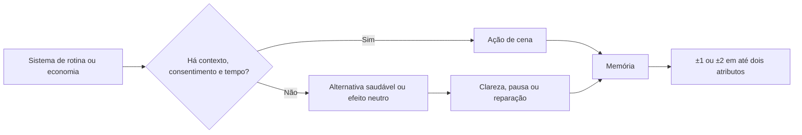

# Matriz de Integração de Sistemas — Rota de Pamela

## Princípio geral

Os sistemas de rotina e economia devem criar **condições de cena**, não comprar avanço afetivo. Uma escolha económica modifica o que cabe no dia; a resposta de Pamela depende de contexto, consentimento, memória e dos quatro atributos relacionais. Nenhuma transferência de dinheiro, compra ou investimento altera Vínculo, Clareza, Segurança ou Tensão sem uma ação narrativa posterior.

## Tempo, energia e trabalho

| Sistema | Regra global | Efeito específico na rota de Pamela | Atributos possíveis |
|---|---|---|---|
| **Três blocos diários** | Manhã, tarde e noite; cada ação avança um bloco. | Dates e conversas com Pamela ocupam uma janela concreta; aceitar um convite e depois não aparecer deve criar uma cena de explicação, não uma punição automática. | Explicar atraso: +Segurança; sumir após combinar: +Tensão, −Segurança. |
| **Energia 4/dia** | Ações custam 0–2 de energia. | Cozinhar, procurar objeto e date usam 1 energia; turno de trabalho usa 2. Energia baixa converte date em chá, caminhada ou adiamento claro. | Adiar com clareza: +Segurança; insistir exausto e desligado: nenhum ganho de Vínculo. |
| **Turno de trabalho** | 2 energia e +§60 pessoal. | Gera dinheiro para escolhas futuras, mas pode ocupar a noite de uma conversa planejada. Só impacta Pamela se existir compromisso explícito. | Comunicar mudança: +Clareza; faltar sem aviso: +Tensão. |
| **Trabalho remoto** | 1 energia e +§35 pessoal. | Melhor opção quando há uma janela de conversa pendente, porque preserva energia e tempo. | Sem ganho direto; pode manter requisito de energia para cuidado/date. |
| **Descanso / encerrar bloco** | Ação de custo zero que avança tempo. | Permite reconhecer limite de energia em vez de tratar disponibilidade como prova de amor. | Descansar após explicar: +Segurança em cena de follow-up. |

## Carteiras e Fundo da Família

| Sistema | Regra | Integração com Pamela | Limite obrigatório |
|---|---|---|---|
| **Carteira pessoal** | Saldo inicial §120; custeia items, dates, contribuições e investimentos. | Habilita ingredientes, lembrança contextual e date; não concede efeito por gasto isolado. | Nenhum item aumenta mais de dois atributos, e apenas se Pamela aceitou o contexto. |
| **Fundo da Família** | Saldo inicial §180; recebe contribuições; serve recursos coletivos. | Pode financiar café da manhã do núcleo, reparo leve ou passeio coletivo com Pamela e Jessica. | Nunca paga presente individual para Pamela; não pode contornar conversa com Jessica. |
| **Contribuição** | Transferência pessoal → familiar sem custo de energia. | Quando ocorre após conversa sobre o núcleo, pode abrir uma cena coletiva de Clareza. | Não gera Vínculo individual com Pamela por si só. |
| **Recurso coletivo insuficiente** | Uma despesa compartilhada não pode ser feita. | Abre alternativa doméstica gratuita: chá, cozinhar com inventário existente ou varanda. | Falta de saldo não eleva Tensão automaticamente. |

## Loja, inventário e presentes

| Sistema | Item / ação | Requisito narrativo | Efeito possível com Pamela | Resultado se mal usado |
|---|---|---|---|---|
| **Loja** | Ingredientes frescos — §12 | Pamela aceitou cozinhar juntas. | Habilita +1 Vínculo e +1 Segurança pela cena de escolha de sabores. | Cozinhar sem convite gera efeito neutro. |
| **Loja** | Chá aromático ou vela pequena — §8 a §12, item proposto | Pamela citou um aroma, sabor ou memória específica. | Cria memória contextual; +1 Vínculo **ou** +1 Clareza. | Oferecer em momento de Tensão 4+ converte a cena em pergunta, sem ganho. |
| **Loja** | Lembrança para Jessica — §8 a §16, item proposto | Pamela quer incluir Jessica de modo transparente. | +1 Clareza e −1 Tensão por reconhecer o vínculo fundador. | Comprar como modo de pedir validação cria +1 Tensão. |
| **Inventário** | Guardar item até o contexto apropriado. | A pessoa jogadora pode esperar ou perguntar quando seria bom oferecer. | Respeitar o tempo de Pamela: +1 Segurança. | Presentear como surpresa com Segurança < 3: efeito neutro ou +1 Tensão. |
| **Sobremesa compartilhada** | §16 | Cena coletiva do trio ou escolha de Pamela. | +1 Vínculo do núcleo; pode gerar memória compartilhada. | Não substitui o date individual nem garante romance. |

## Cuidado, favores e tarefas

| Ação | Custo | Contexto de Pamela | Efeito de atributo | Limite de repetição |
|---|---:|---|---|---|
| Preparar bebida escolhida por Pamela | 1 energia / §0–§12 | Ela indica aroma, temperatura ou sabor. | +1 Segurança **ou** +1 Vínculo. | Uma vez por semana. |
| Procurar objeto esquecido junto com ela | 1 energia / §0 | Pamela pede ou aceita ajuda. | +1 Vínculo, +1 Clareza. | Uma vez por etapa. |
| Cozinhar receita escolhida juntas | 1 energia / ingredientes | Segurança ≥ 3 e ingredientes disponíveis. | +1 Vínculo, +1 Segurança. | Uma vez por semana. |
| Arrumar espaço comum para uma conversa | 1 energia / §0 | Pamela concorda sobre o espaço e o objetivo. | −1 Tensão ou +1 Segurança. | Uma vez por etapa. |
| Acompanhar escolha de lembrança para Jessica | 1 energia / item opcional | Clareza ≥ 2; Pamela inicia ou aceita o gesto. | +1 Clareza, −1 Tensão. | Uma vez na rota. |
| Resolver algo sem perguntar | 1 energia / variável | Sempre possível, mas desalinhado. | +1 Tensão; abre reparação. | Não pode gerar ganho posterior até reparação. |

## Dates e mapa de conversas

| Sistema | Regra | Efeito na rota de Pamela |
|---|---|---|
| **Mapa de conversas** | Cada rota possui capítulo, memória e estado próprios. | A rota de Pamela mostra a última memória e adapta a abertura do capítulo seguinte ao gesto recente. |
| **Date de baixo custo** | 1 energia e §0–§8; requer Segurança ≥ 3. | Chá, caminhada, feira ou litoral; foco em curiosidade, escolha de Pamela e conversa sobre ritmo. |
| **Date padrão** | 1 energia e §18; requer Vínculo ≥ 3 e Segurança ≥ 3. | Banca de livros, café ou mercado noturno; libera a cena “Uma noite não responde tudo”. |
| **Date indisponível** | Segurança ≤ 2 ou Tensão ≥ 4. | Interface oferece conversa com hora marcada, caminhada em espaço comum ou pausa clara. |
| **Convite aceito, energia insuficiente** | Energia 0 antes da cena. | O jogo propõe reagendar com explicação; reagendar não bloqueia a rota. |

## Crescent Market fictício

| Sistema | Regra global | Relação com Pamela |
|---|---|---|
| **Reserva Nocturna** | Baixo risco; pequenos retornos semanais. | Pode preservar saldo para uma escolha futura, mas não gera atributo e não é necessário para o melhor desfecho. |
| **Círculo de Bairro** | Risco médio; oscilação moderada. | Pode reduzir dinheiro disponível, criando uma versão de date de baixo custo; a falta de saldo nunca reduz Vínculo. |
| **Palco Violeta** | Risco alto; oscilação maior. | Serve ao estilo de jogo financeiro, não à rota. Pamela pode perguntar se a pessoa jogadora se sente segura com a escolha, mas não aprova ou reprova pelo retorno. |
| **Limite de §80/semana** | O capital investido é limitado e pode ser resgatado. | Impede que investimento substitua trabalho, rotina ou presença. |

## Conversão de sistemas em efeitos de atributo

## Exemplo de percurso econômico-relacional

| Bloco | Escolha sistêmica | Resultado de estado | Consequência para Pamela |
|---|---|---|---|
| Segunda de manhã | Trabalho remoto | +§35, −1 energia | Ainda há energia para responder ao convite de Pamela. |
| Segunda à tarde | Comprar ingredientes — §12 | Inventário recebe ingredientes | Cozinhar fica disponível, mas não concede ponto ainda. |
| Segunda à noite | Cozinhar com escolha de sabor de Pamela | −1 energia; usa ingredientes | +1 Vínculo, +1 Segurança e memória de cuidado. |
| Terça de manhã | Contribuir §30 ao Fundo da Família | pessoal → familiar | Pode abrir café da manhã coletivo com Jessica; +Clareza somente se Pamela desejar a cena. |
| Terça à noite | Date de baixo custo | −§8, −1 energia | +1 Vínculo ou +1 Clareza conforme a conversa de ritmo. |
| Fim da semana | Crescent Market rende ou oscila | saldo pessoal muda | Nenhum atributo muda; o próximo date adapta-se ao saldo disponível. |
